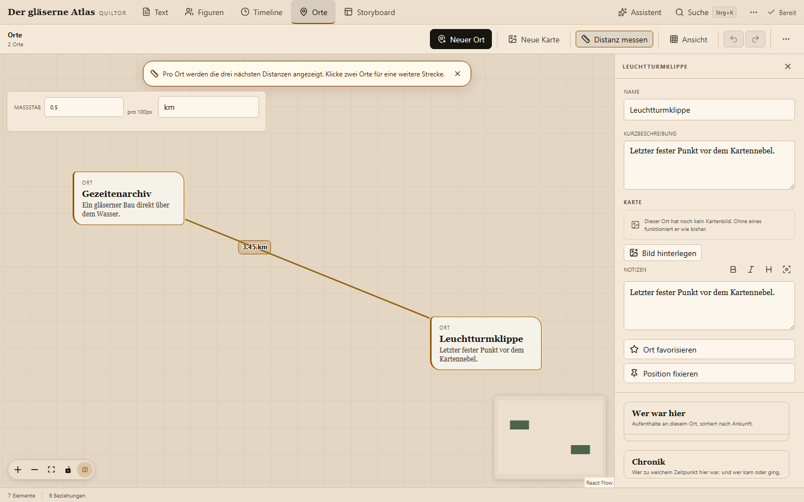

# Quiltor

[Deutsch](README.md) · [English](README.en.md)

> ## You write the story. Quiltor keeps the world straight.
>
> **A local-first writing workspace for people who actually want to write.**  
> Manuscript, characters, relationships, places, and timeline in one place — with local AI for the work **around** writing, never for the writing itself.


Quiltor is a writing environment for novels and other long-form fiction. Instead of spreading your manuscript, character sheets, timeline, maps, and notes across several applications, Quiltor connects them into one shared fictional world.

Its local assistant may understand that world, search it, and prepare structured changes. **It deliberately has no tool for writing, continuing, or rewriting manuscript prose.**

**Local-first · On-device AI · macOS / Windows / Browser · Source-available**

[**Quick start**](#quick-start) · [**Features**](#a-writing-workspace-not-an-ai-ghostwriter) · [**Technical documentation**](#technical-documentation) · [**Releases**](https://github.com/Tim3399/quiltor/releases)

---

## A writing workspace, not an AI ghostwriter

Many AI writing tools try to take over more and more of the actual writing. Quiltor deliberately goes the other way.

> **AI for the work around writing. Never for the writing itself.**

You write every sentence. Quiltor helps reduce the bookkeeping around it:

- keep characters, animals, places, organizations, objects, and concepts together
- visualize relationships and let them change over time
- track where characters are and how they move through the world
- arrange places on a dedicated map and measure distances
- maintain a real story timeline and life events
- search manuscript, chapter notes, and world knowledge together
- use local spelling, grammar, synonym, and word-translation tools
- let the assistant prepare structured changes and **decide yourself what gets applied**

The author remains the final authority.

---

## One world instead of scattered notes

Quiltor does not treat worldbuilding as a pile of unrelated text fields. Characters, places, relationships, and timeline share the same underlying world.

### Manuscript: write without the interface getting in the way

The chapter editor stays quiet and gives the prose room. Focus mode, undo/redo, chapter notes, local history, discreet writing aids, and one-word autocomplete support the writing process without taking it over.

A readable 6 × 9 inch book PDF can be exported from the manuscript.

### Characters and relationships: see what belongs together

Characters and other world elements live in a visual graph. Relationships may be directed or undirected, change meaning, start, or end.


The graph is not a second copy of your data: timeline, relationships, and elements use the same state.

### Places: understand the world spatially

Places have their own map and can be positioned freely, independently from their position in the world graph.

A ruler measures distances between places and converts them through an adjustable scale into your own units.



Timeline presence data automatically produces:

- a stay chronicle for each place
- a journey history for each character
- temporal gaps between moves

### Timeline: the world changes

Stories are not static. A friendship can break, a character can move, an object can become important, and a character can die.

Quiltor models those changes along the timeline instead of storing only the latest state.


The dedicated timeline workspace is built for maintenance: order moments, add notes, change relationship states, and mark life events.


---

## A local assistant that cannot write your book

The assistant runs through a local model using `llama.cpp` or, on Apple Silicon, MLX.

It can:

- search manuscript and world knowledge
- answer questions about the story
- cite sources from the project
- analyse characters, places, relationships, and timeline state
- prepare structured changes as proposals
- process broad tasks chapter by chapter in batches

It cannot:

- write a scene
- continue a chapter
- rewrite prose
- silently apply changes

World changes are returned as reviewable proposals. Only explicit confirmation applies them to the project, as one undoable history step.

The manuscript is readable context for the assistant — never a writing surface for it.

---

## Local-first means your project belongs to you

A local Quiltor setup needs no cloud account.

Every world is stored in its own SQLite database on your machine. Manuscript and profile data are additionally mirrored into readable Markdown files. Automatic local backups and project history are part of the storage model.

Remote backup is optional and can be run against your own backup endpoint.

The assistant remains local as well:

- model runtime on loopback
- no mandatory cloud AI provider
- external LanguageTool-compatible services only after explicit opt-in
- no manuscript-writing tools in the assistant or MCP

---

## What is included today

| Writing             | World knowledge                  | Places             | Time                         | Assistance           |
| ------------------- | -------------------------------- | ------------------ | ---------------------------- | -------------------- |
| Chapter editor      | Characters & other element types | Dedicated map      | Dedicated timeline           | Local LLM            |
| Focus mode          | Profiles & custom fields         | Free placement     | Time-dependent relationships | Project citations    |
| Chapter notes       | Visual relationship graph        | Distance measuring | Presence / stays             | Structured proposals |
| Undo/redo & history | Directed relationships           | Journey chronicles | Death moments                | Batch processing     |
| Book PDF            | Minimap & semantic zoom          | Custom map scale   | Graph playback               | Proposal-only MCP    |
| German writing aids | Important / pinned elements      |                    |                              | No prose generation  |

---

## Who is Quiltor for?

Quiltor is especially useful if you:

- want to write yourself rather than use AI as a ghostwriter
- work on long novels or series
- need to keep many characters, places, and relationships straight
- do not want timeline and world knowledge scattered across spreadsheets
- want manuscript and world data to remain local
- think visually but still need a real writing application

Quiltor is under active development. Its focus is a calm writing workflow, a connected fictional world, and transparent local assistance.

---

# Quick start

Requires **Python 3.11+**.

```bash
git clone https://github.com/Tim3399/quiltor.git
cd quiltor
python3 apps/web/server.py
```

On Windows the Python command is commonly `python` instead of `python3`.

Quiltor opens `http://localhost:8000` by default and creates an empty world on first launch. If no local assistant is installed, Quiltor asks before downloading anything; the rest of the application works without the assistant.

CLI/Python packages, desktop builds, and Docker deployment are also supported. Details follow below.

---

# Technical documentation

The following sections cover installation, the local runtime, authentication, backup, desktop/Docker operation, MCP, development, and architecture.

## Contents

- [Installation options](#installation-options)
- [Local assistant and runtime contract](#local-assistant-and-runtime-contract)
- [MCP](#mcp)
- [German writing tools](#german-writing-tools)
- [Local access and authentication](#local-access-and-authentication)
- [Desktop app](#desktop-app)
- [Docker and web demo](#docker-and-web-demo)
- [CLI](#cli)
- [Backup and Keycloak](#backup-and-keycloak)
- [Local data, history, and restore](#local-data-history-and-restore)
- [Keyboard controls](#keyboard-controls)
- [Development and quality](#development-and-quality)
- [Architecture](#architecture)
- [Status and license](#status-and-license)

---

## Installation options

### Run directly from the repository

The built web client already lives in `dist/`. Node dependencies are not required for normal editing and local storage.

```bash
git clone https://github.com/Tim3399/quiltor.git
cd quiltor
python3 apps/web/server.py
```

Other start options:

```bash
python3 apps/web/server.py 8080            # custom port
python3 apps/web/server.py 8080 --no-open  # do not open a browser
python3 apps/web/server.py --print-token   # show this run's access token
```

### Python wheel / pip / pipx

Every [GitHub release](https://github.com/Tim3399/quiltor/releases) ships a Python wheel.

```bash
pip install quiltor-<version>-py3-none-any.whl
quiltor
```

The package requires Python 3.11 or newer. The normal server path intentionally stays lightweight; the packaged CLI uses `typer`.

The base wheel deliberately reports PDF export as unavailable instead of
silently downloading a browser runtime. For PDF export from the **installed
wheel**, install the verified extra (substitute the release URL and version):

```bash
python -m pip install "quiltor[browser-pdf] @ https://github.com/Tim3399/quiltor/releases/download/v<version>/quiltor-<version>-py3-none-any.whl"
```

The extra pins the PyPI-published Python library Playwright 1.61.0 and drives an
already installed Google Chrome or Microsoft Edge. It needs neither system
Node.js nor a separate Chromium
download. Without the extra or a supported browser, export remains disabled
with an explicit capability message.
The self-hosted OCI host is a separate artifact path: it uses the Playwright
1.61.1 npm/browser runtime from its digest-bound base image. Both pins are
recorded separately in `distribution/toolchains.json` and the release gate
checks them against the installed artifacts.
The wheel host resolves web assets and its bundled render script exclusively
from package resources; it does not fall back to an incidental source checkout.
Capability selection remains separate: without the extra it deterministically
uses the typed unavailable renderer.

### Development

A run directly from the **source checkout** instead uses the bundled JavaScript
renderer. Frontend development and this PDF path require Node.js, the project
dependencies and the verified Chromium:

```bash
npm install
npx playwright install chromium
npm run dev
```

Run alongside:

```bash
python3 apps/web/server.py --no-open
```

Vite forwards API requests to port 8000.

---

## Local assistant and runtime contract

The assistant searches chapters, notes, profiles, elements, relationships, and timeline states as one local knowledge corpus. Answers may cite clickable project sources.

The model runtime uses:

- `llama.cpp`
- optional MLX on Apple Silicon Macs

On first launch, Quiltor can install the appropriate runtime and model after explicit confirmation. A direct repository checkout stores these under `runtime/` and `models/`.

Explicit installation:

```bash
PYTHONPATH=src python3 -m quiltor.infrastructure.inference.installer
```

Force an existing runtime or different GGUF model:

```bash
QUILTOR_AI_BINARY=/path/to/llama-server \
QUILTOR_AI_MODEL=/path/to/model.gguf \
python3 apps/web/server.py
```

Or connect an already running local endpoint:

```bash
QUILTOR_AI_URL=http://127.0.0.1:11435 python3 apps/web/server.py
```

### Runtime contract

`QUILTOR_AI_URL` is **not a generic OpenAI-provider integration**. The runtime must implement Quiltor's stable local contract:

```text
GET  /health
POST /tokenize
POST /v1/chat/completions
```

`/v1/chat/completions` must actually enforce the strict JSON schemas requested by Quiltor.

The bundled runtime backends currently use an 8192-token context window. Requests to the bundled runtime remain on loopback.

### Real local-assistant test

```bash
npm run test:assistant:local
npm run test:assistant:local -- --runs 3
npm run test:assistant:local -- --case set-presence
```

The test starts the runtime, fixture world, and Quiltor inside an isolated temporary directory and shuts everything down afterwards.

---

## MCP

`src/quiltor/hosts/mcp/quiltor_server.py` exposes retrieval and world maintenance as an MCP server.

The safety rule is the same as in the built-in assistant:

- reads are allowed
- changes are returned as proposals only
- application happens in Quiltor after confirmation

There are deliberately no direct:

- apply tools
- delete tools
- backup/filesystem tools
- manuscript-writing tools

The bundled `.mcp.json` configures the server through the platform-neutral
`quiltor-mcp` command. After `python -m pip install -e .`, the same project
configuration works on Windows, macOS, and Linux.

---

## German writing tools

Manuscripts using writing language `de-DE` currently have local:

- dictionary lookup
- synonyms
- word translation
- spelling checks
- grammar checks

Selected text can be looked up. Insertion, replacement, and correction happen only after an explicit action and remain undoable.

The guided setup installs the language tools by default:

```bash
quiltor install
```

Data is stored under:

```text
data/writing-assistance/
```

or, for pipx/CLI installations:

```text
~/.quiltor/data/writing-assistance/
```

Existing data in the former `data/language/` directory is migrated safely on first launch;
no manual move is required.

LanguageTool requires **Java 17+**. Browser spellchecking remains available without it.

External LanguageTool-compatible services are only used when:

```bash
QUILTOR_LANGUAGETOOL_EXTERNAL_OPT_IN=1
```

is set. Without that opt-in, chapter text and lookup terms used by this feature stay on the device.

Sources, versions, checksums, licenses, and attribution are recorded in the installation manifest and [THIRD-PARTY-NOTICES.md](THIRD-PARTY-NOTICES.md).

---

## Local access and authentication

There is no "authentication off" mode. Every request has an identity; locally, that identity is simply the person at the machine.

Without `QUILTOR_OIDC_ISSUER`, Quiltor uses the **local identity**:

- one user
- no login page
- no account management

Access is recognised in this order:

1. `Authorization: Bearer <token>` — scripts and MCP
2. `?token=<token>` — one-time browser entry; the redirect strips the parameter
3. loopback connection — ordinary case for desktop, CLI, and `python3 apps/web/server.py`

The automatically generated token:

- is created fresh on every process start
- lives only in memory
- is never written to disk
- is only printed when explicitly requested with `--print-token`

| Variable               | Purpose                                                                                                            |
| ---------------------- | ------------------------------------------------------------------------------------------------------------------ |
| `QUILTOR_MASTER_TOKEN` | Pins the token. Intended for tests or instances not bound to loopback. Do not store it in `~/.quiltor/config.env`. |
| `QUILTOR_HOST`         | Bind address; defaults to `127.0.0.1`.                                                                             |

An instance bound to `0.0.0.0` without OIDC cannot rely on the local loopback identity and therefore requires a token. For a persistent web deployment, OIDC/Keycloak is the intended path.

### Troubleshooting

| Symptom                                     | Fix                                                                                                  |
| ------------------------------------------- | ---------------------------------------------------------------------------------------------------- |
| `python3: command not found`                | On Windows, use `python` in most installations.                                                      |
| Assistant reports "Local model unavailable" | Run `PYTHONPATH=src python3 -m quiltor.infrastructure.inference.installer`, then restart the server. |
| Download is interrupted                     | Run the installer again; complete files are reused.                                                  |
| Firewall/antivirus flags `llama-server.exe` | The binary comes from the official llama.cpp release and listens locally.                            |
| Port 8000 is taken                          | `python3 apps/web/server.py 8080`                                                                    |
| Different runtime / model                   | Use `QUILTOR_AI_BINARY`, `QUILTOR_AI_MODEL`, or `QUILTOR_AI_URL`.                                    |

---

## Desktop app

Quiltor can be built as a standalone macOS or Windows desktop application — a native window instead of a browser tab, with no separate Python installation required on the target machine.

```bash
python -m venv .venv-desktop
source .venv-desktop/bin/activate  # Windows: .venv-desktop\Scripts\activate
pip install -e ".[desktop]" pyinstaller
```

Build:

```bash
./distribution/desktop/macos/direct/build.sh
powershell -File distribution/desktop/windows/direct/build.ps1
```

Output:

```text
macOS   distribution/artifacts/macos-direct/Quiltor-<version>.dmg
Windows distribution/artifacts/windows-direct/Quiltor-Setup-<version>.exe
```

Local builds are unsigned by default.

The macOS build signs and notarizes automatically when these are configured:

```text
QUILTOR_SIGN_IDENTITY
QUILTOR_NOTARY_PROFILE
```

PDF export uses the installed system browser or the platform-specific renderer rather than unnecessarily bundling a complete browser into every desktop build.

More details and the complete target matrix: [`distribution/README.md`](distribution/README.md)

---

## Docker and web demo

Quiltor can run as a small multi-user deployment behind a reverse proxy. In this mode an existing Keycloak instance authenticates users, and each signed-in person sees only their own worlds.

Quiltor ships **no Keycloak of its own**.

### Keycloak client for the web instance

Recommended settings:

- Client authentication: **on**
- Standard Flow: **on**
- Direct Access Grants: **off**
- Redirect URI: `https://<your-domain>/auth/callback`
- PKCE: `S256`

Environment variables:

| Variable                     | Purpose                                                    |
| ---------------------------- | ---------------------------------------------------------- |
| `QUILTOR_OIDC_ISSUER`        | Realm issuer, e.g. `https://kc.example.com/realms/quiltor` |
| `QUILTOR_OIDC_CLIENT_ID`     | Client ID                                                  |
| `QUILTOR_OIDC_CLIENT_SECRET` | Client secret                                              |
| `QUILTOR_PUBLIC_URL`         | Public Quiltor URL                                         |
| `QUILTOR_COOKIE_SECURE`      | `auto` / `0` / `1`                                         |
| `QUILTOR_HOST`               | Bind address                                               |
| `QUILTOR_MASTER_TOKEN`       | Only relevant without OIDC                                 |
| `QUILTOR_DATA_DIR`           | Data directory inside the container                        |

Start:

```bash
cp .env.example .env
docker compose up -d
```

The Compose service is normally bound locally; point your existing reverse proxy at Quiltor. Example Caddy and nginx configurations live under [`distribution/web/self-hosted/proxy/`](distribution/web/self-hosted/proxy/).

Optionally let the stack run Caddy itself:

```bash
docker compose --profile with-caddy up -d
```

Caddy then terminates TLS and forwards internally to `quiltor:8000`.

Without Compose, use the [`Dockerfile`](Dockerfile) directly.

The Docker image is based on Microsoft's Playwright image because book-PDF export in web mode uses a real headless Chromium.

Sessions live in process memory. Restarting the container therefore signs web users out.

### Prebuilt container images

A version bump in `VERSION` on `main` triggers the release pipeline. Images are published as:

```text
ghcr.io/tim3399/quiltor:<version>
ghcr.io/tim3399/quiltor:latest
```

---

## CLI

The `quiltor` CLI is available in pip/pipx installations.

Default location for data, runtime, and model:

```text
~/.quiltor/
```

Override with:

```text
QUILTOR_HOME
```

Important commands:

```bash
quiltor install
quiltor
quiltor run 8080
quiltor run --print-token

quiltor config set <KEY> <VALUE>
quiltor config get <KEY>
quiltor config list
quiltor config unset <KEY>
quiltor config path

quiltor --version
```

`quiltor install` guides the local setup. Keycloak is optional by default; German writing tools and the local assistant can be installed during setup.

For Docker, environment variables remain the primary configuration path.

---

## Backup and Keycloak

Keycloak has two separate roles in Quiltor:

|           | Signing in to Quiltor                | Backup endpoint                             |
| --------- | ------------------------------------ | ------------------------------------------- |
| Purpose   | Multi-user web instance              | Remote-backup access                        |
| Required  | No                                   | Yes for the supplied backup endpoint        |
| Client    | confidential                         | backup server confidential + Quiltor public |
| Redirect  | `<QUILTOR_PUBLIC_URL>/auth/callback` | `http://127.0.0.1/*`                        |
| Variables | `QUILTOR_OIDC_*`                     | `QUILTOR_BACKUP_OIDC_*`                     |

Both may use the same realm, but they are technically separate.

### Backup server: confidential client

Example name:

```text
quiltor-backup-server
```

Settings:

- Client authentication: on
- Standard Flow: off
- Direct Access Grants: off

The backup server validates incoming access tokens through Keycloak Token Introspection.

### Quiltor: public backup client

Example:

```text
quiltor-desktop
```

Settings:

- Client authentication: off
- Standard Flow: on
- Direct Access Grants: off
- PKCE: `S256`
- Redirect URI: `http://127.0.0.1/*`

The changing loopback port is intentional. Native applications are expected to support dynamic loopback ports under RFC 8252, so the Keycloak client must not be restricted to one fixed port.

### `quiltor.backup` scope

The supplied backup endpoint requires this scope by default:

```text
quiltor.backup
```

This prevents an arbitrary valid token from the same realm from being enough. The token must explicitly be intended for backup access.

A realm role may additionally be used to make the scope available only to selected accounts.

### Backup-server variables

| Variable                            | Purpose                                      |
| ----------------------------------- | -------------------------------------------- |
| `QUILTOR_BACKUP_OIDC_ISSUER`        | Realm issuer                                 |
| `QUILTOR_BACKUP_OIDC_CLIENT_ID`     | Backup-server client ID                      |
| `QUILTOR_BACKUP_OIDC_CLIENT_SECRET` | Client secret used for introspection         |
| `QUILTOR_BACKUP_PUBLIC_URL`         | Public backup endpoint URL                   |
| `QUILTOR_BACKUP_OIDC_SCOPE`         | Required scope; defaults to `quiltor.backup` |

If required authentication values are missing, the backup endpoint deliberately refuses to start.

Example:

```bash
# Backup server
QUILTOR_BACKUP_OIDC_ISSUER=https://kc.example.com/realms/quiltor
QUILTOR_BACKUP_OIDC_CLIENT_ID=quiltor-backup-server
QUILTOR_BACKUP_OIDC_CLIENT_SECRET=...
QUILTOR_BACKUP_PUBLIC_URL=https://backup.example.com
QUILTOR_BACKUP_OIDC_SCOPE=quiltor.backup

# Quiltor
QUILTOR_BACKUP_URL=https://backup.example.com
QUILTOR_BACKUP_CLIENT_ID=quiltor-desktop
```

The client does not need a duplicate Keycloak issuer setting for the backup service. The endpoint publishes its authorization metadata through:

```text
GET /.well-known/oauth-protected-resource
```

Quiltor reads that metadata before sign-in.

### Backup troubleshooting

| Symptom                                                     | Likely cause                                                      |
| ----------------------------------------------------------- | ----------------------------------------------------------------- |
| Keycloak error page and Quiltor never receives the callback | Loopback redirect is missing or restricted to a fixed port        |
| Endpoint returns 401                                        | Token is missing or expired                                       |
| Endpoint returns 403                                        | Token is valid but lacks the required scope                       |
| Introspection fails                                         | Token and `QUILTOR_BACKUP_OIDC_ISSUER` belong to different realms |

---

## Local data, history, and restore

- Every world has its own SQLite file under `data/worlds/`.
- SQLite is the authoritative data source.
- Manuscript/profile mirrors live per world under `data/manuscripts/<world-id>/` and `data/profiles/<world-id>/`.
- Automatic SQLite backups can be restored locally.
- Revision checks prevent stale browser tabs from overwriting newer changes.
- Every world keeps local version history.
- Snapshots are content-addressed, so unchanged chapters do not need to be stored repeatedly.
- Remote backup is optional.
- World content, models, backups, and history are excluded from public version control.

### Notes for upgrading older versions

Current builds always use an identity. Locally, the local identity takes over; non-loopback instances without OIDC require a token.

Markdown mirrors are now organized per world. Old flat mirror files are not the authoritative source; SQLite remains authoritative.

The server no longer has one process-wide "open world" state, so restoring a world does not require closing a global open-world session first.

---

## Keyboard controls

| Shortcut                         | Action                       |
| -------------------------------- | ---------------------------- |
| `Cmd/Ctrl + S`                   | Save immediately             |
| `Cmd/Ctrl + Shift + S`           | Open backup dialog           |
| `Cmd/Ctrl + F` or `Cmd/Ctrl + K` | Search & commands            |
| `Cmd/Ctrl + Z`                   | Undo                         |
| `Cmd/Ctrl + Shift + Z`           | Redo                         |
| `Esc`                            | Leave focus/temporary mode   |
| `Option/Alt` while dragging      | Temporarily release the grid |

---

## Development and quality

```bash
npm test
npm run build
python3 -m unittest discover -s tests/python -t . -v
npm run test:e2e
```

The build checks, among other things:

- TypeScript
- design-token rules
- i18n key parity
- hardcoded visible UI text
- the built client

Browser/E2E tests cover core workspaces, desktop/compact layouts, light/dark mode, autosave, conflicts, and accessibility.

Internationalization check:

```bash
npm run check:i18n
```

Visible UI text and new translation packs belong in the deliberately prominent root directory:

```text
locales/{de,en,...}/*.ts
```

Adding Spanish, for example, requires exactly one prominent catalog import and `localePackages`
entry in [`locales/index.ts`](locales/index.ts). No other registry or UI code change is needed;
the i18n check automatically enforces directory-to-registry parity. See
[`CONTRIBUTING.md`](CONTRIBUTING.md).

Reproduce README screenshots:

```bash
PLAYWRIGHT_BASE_URL=http://127.0.0.1:8125 node tools/documentation/capture_readme.mjs
```

---

## Architecture

```text
apps/                        visible shells and native project roots
├── web/server.py            source-checkout bootstrap
└── mobile/{ios,android}/     native mobile hosts

src/quiltor/
├── domain/story_world/      pure world logic, chronology, and validation
├── application/             shared use cases and domain-facing ports
├── modules/                 assistant, writing aid, identity, and commerce
├── infrastructure/          SQLite, backup, inference, PDF, platform adapters
├── resources/sidecars/      shipped PDF and inference subprocess assets
├── bootstrap/               composition root for concrete adapters
├── delivery/http/routes/    HTTP endpoints grouped by capability
└── hosts/                   web server, desktop, CLI, and MCP

services/backup-server/      independently deployable backup service
contracts/                   versioned application and native-bridge contracts
crates/                      portable Rust core and FFI
distribution/                target profiles, builds, installers, stores, signing
tools/                       quality, evaluation, and documentation tooling

packages/client/src/
├── app/                     composition, shell, layout hooks, versioned app contracts
├── config/                  application configuration and branding
├── design/                  design tokens and presentation foundations
├── i18n/                    locale runtime, provider, and catalog loader
├── modules/
│   ├── manuscript/          editor and writing aids
│   ├── story-world/         figures, places, timeline, and world management
│   ├── assistant/           local assistant
│   ├── identity/            sign-in and identity
│   ├── backup/              local backup restoration
│   ├── history/             history and snapshots
│   └── search/              search and navigation
├── platform/                host gateways, HTTP transport, browser/desktop adapters
└── shared/                  shared UI components and domain-neutral helpers

locales/                      contributor-friendly UI translation packs
```

Dependency direction is intentional:

```text
Hosts/Delivery → Application use cases → Domain
Bootstrap → Application ports + concrete infrastructure adapters
Domain/Application ↛ infrastructure/delivery/hosts
```

The normal server path stays small and local; additional capabilities are added through clearly separated modules and distribution extras.

---

## Status and license

Quiltor is under active development.

Quiltor is **source-available, not open source**. The source is public, modifiable, and redistributable, while commercial use by larger organizations is restricted.

It is offered under your choice of:

- [PolyForm Noncommercial License 1.0.0](https://polyformproject.org/licenses/noncommercial/1.0.0)
- [PolyForm Small Business License 1.0.0](https://polyformproject.org/licenses/small-business/1.0.0)

See [LICENSE](LICENSE).

### Free without asking

- noncommercial use: personal projects, hobby work, study, teaching, research, charities, and public institutions
- commercial use under the PolyForm Small Business License: fewer than 100 employees/independent contractors and less than USD 1,000,000 total revenue in the previous tax year

Self-employed authors are effectively always within the small-business threshold.

Commercial use above that threshold requires an individual agreement:

**tim.ratermann@outlook.de**

Details: [COMMERCIAL.md](COMMERCIAL.md)

Release packages additionally contain third-party software and model weights under their own licenses. See [THIRD-PARTY-NOTICES.md](THIRD-PARTY-NOTICES.md).
