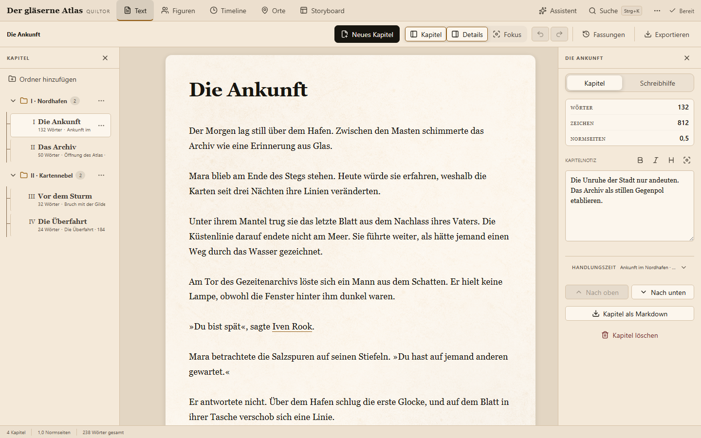
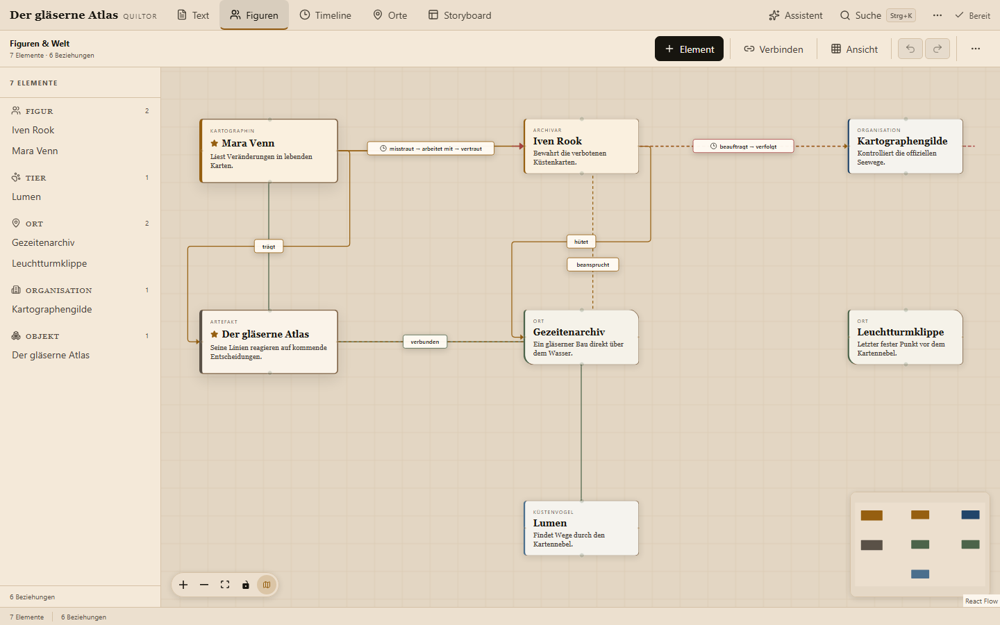
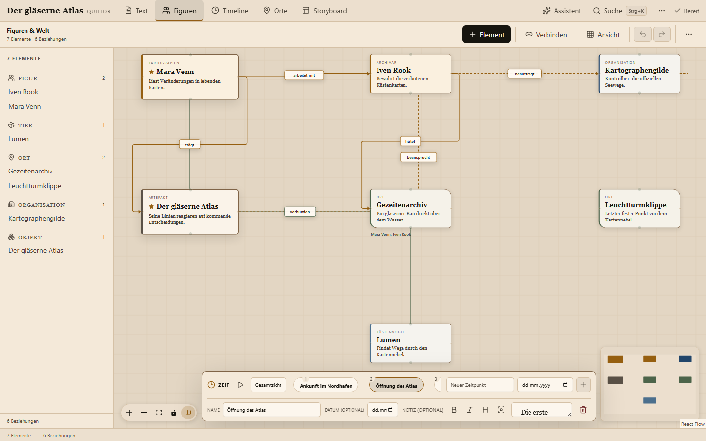
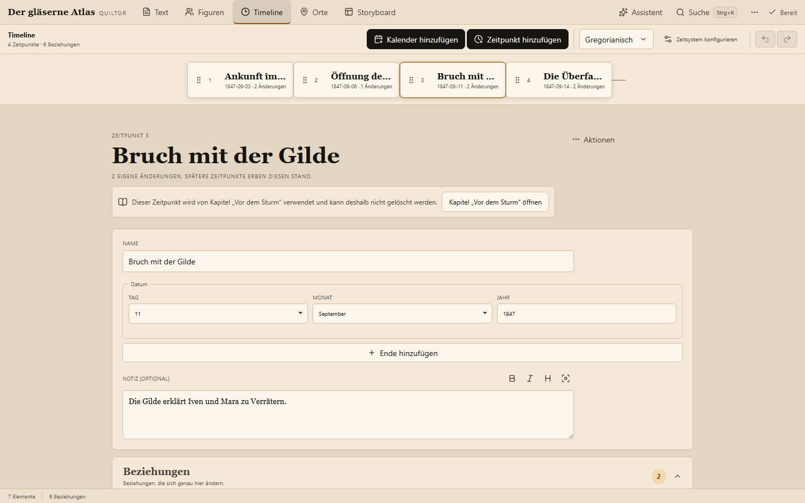

# Quiltor

[Deutsch](README.md) · [English](README.en.md)

> Eine lokale Autorenwerkstatt für Manuskript, Weltwissen und zeitabhängige Beziehungen – entwickelt, um das Schreiben einfacher zu machen, nicht um es zu ersetzen.



Quiltor verbindet einen ruhigen Kapitel-Editor mit einem visuellen Weltgraphen, einer echten Timeline und einem lokalen Rechercheassistenten. Jede Welt bleibt als eigene SQLite-Datenbank auf deinem Rechner. Git-Backups sind optional, aber empfohlen.

## Was Quiltor kann

| Schreiben | Welt aufbauen | Zeit verwalten |
| --- | --- | --- |
| Kapitel-Editor und Fokusmodus | Figuren, Tiere, Orte, Organisationen, Objekte und Konzepte | Eigener Timeline-Arbeitsbereich |
| Diskrete Schreibhilfen und Ein-Wort-Autocomplete | Gerichtete und ungerichtete Beziehungen | Beziehungsstatus je Zeitpunkt |
| Kapitelnotizen, Versionen und Undo/Redo | Raster, Minimap und semantischer Zoom | Richtung, Bezeichnung und Aktivität verändern |
| Buch-PDF im lesbaren 6 × 9-Zoll-Format | Profile, eigene Felder und wichtige Elemente | Todeszeitpunkte und animierte Wiedergabe |

### Ein Weltgraph statt verstreuter Notizen

Elemente besitzen feste Positionen, während Beziehungen über die Zeit erscheinen, verschwinden oder ihre Bedeutung ändern. Das Board unterstützt ein dezentes Raster, freie Positionierung, automatische Ausrichtung, Minimap und einen reduzierten Übersichtszoom.



### Timeline direkt im Board

Der Zeitstreifen spielt die Entwicklung der Welt ab, ohne Elemente oder Kamera zu verschieben. Frühere Beziehungswerte werden vererbt, bis ein Zeitpunkt sie ausdrücklich überschreibt.



### Timeline gezielt verwalten

Die eigenständige Timeline-Seite ist für Pflege statt Visualisierung optimiert: Zeitpunkte sortieren, Notizen hinterlegen, Beziehungen aktivieren, umbenennen oder umkehren und Lebensereignisse markieren. Board und Timeline verwenden dieselben Daten – es gibt keine doppelte Wahrheit.



## Lokaler Assistent und RAG

Der Assistent durchsucht Kapitel, Notizen, Profile, Elemente, Beziehungen und sämtliche Timeline-Stände als lokalen Wissenskorpus. Antworten verweisen auf anklickbare Quellen. Das Manuskript ist lesbarer Kontext; der Assistent besitzt bewusst kein Werkzeug zum Schreiben, Fortsetzen oder Verändern von Prosa.

Änderungen an Elementen, Beziehungen und Timeline werden ausschließlich als strukturierte Vorschläge erzeugt. Erst eine ausdrückliche Bestätigung übernimmt sie als einen rückgängig machbaren Undo-Schritt.

Die Modell-Runtime verwendet `llama.cpp` (auf Apple-Silicon-Macs wahlweise MLX, spürbar schneller dort). `python3 server.py` fragt beim ersten Start automatisch nach, falls noch keine Runtime eingerichtet ist, und lädt sie bei Zustimmung nach `runtime/` bzw. `models/` — kein separater Befehl nötig. Ist die Frage einmal übersprungen worden (oder läuft Quiltor als Fenster-App ohne Terminal, siehe [Desktop-App](#desktop-app)), bietet das Assistenten-Panel selbst einen „Jetzt einrichten"-Button mit Fortschrittsanzeige an, sobald der Assistent als „nicht verfügbar" gemeldet wird. Wer das stattdessen explizit oder unbeaufsichtigt (z. B. in einem Skript) auslösen möchte:

```bash
python3 -m backend.llm.installer
```

Wer stattdessen eine vorhandene Runtime, ein anderes GGUF-Modell oder einen vorhandenen lokalen Endpoint verwenden möchte, kann das per Umgebungsvariable erzwingen:

```bash
QUILTOR_AI_BINARY=/pfad/zu/llama-server \
QUILTOR_AI_MODEL=/pfad/zu/model.gguf \
python3 server.py
```

Alternativ lässt sich eine vorhandene lokale Runtime über `QUILTOR_AI_URL` anbinden. Sie muss den **Quiltor-Runtime-Vertrag** mit `GET /health`, `POST /tokenize` und `POST /v1/chat/completions` samt strikt erzwungenem JSON-Schema erfüllen; dies ist keine allgemeine Freigabe beliebiger OpenAI-Endpunkte. Beide gebündelten Backends verwenden 8192 Kontexttokens. Alle Anfragen bleiben auf Loopback.

Der reale Assistenten-Test startet Runtime, Testwelt und Quiltor isoliert in einem temporären Verzeichnis und beendet alle Prozesse anschließend wieder:

```bash
npm run test:assistant:local                         # ein vollständiger Lauf
npm run test:assistant:local -- --runs 3             # Abnahme: drei Läufe
npm run test:assistant:local -- --case set-presence  # einzelnes Szenario
```

### MCP inklusive

`mcp/quiltor_server.py` stellt Retrieval und Weltpflege zusätzlich als MCP-Server bereit. Schreibähnliche Tools erzeugen nur bestätigungspflichtige Vorschläge. Es gibt absichtlich keine direkten Apply-, Delete-, Git-, Datei- oder Manuskript-Schreibtools.

Die mitgelieferte `.mcp.json` konfiguriert den Server automatisch für Clients, die projektbezogene MCP-Konfiguration unterstützen.

## Deutsche Schreibwerkzeuge

Für Manuskripte mit Schreibsprache `de-DE` stehen lokale Wörterbuch-, Synonym- und Wortübersetzungsabfragen sowie eine bestätigungspflichtige Rechtschreib- und Grammatikprüfung bereit. Markierter Text kann nachgeschlagen werden; Einfügen, Ersetzen und Korrigieren geschieht ausschließlich nach einer ausdrücklichen Aktion und bleibt per Undo rückgängig machbar.

Das geführte `quiltor install` richtet die Schreibwerkzeuge standardmäßig mit ein. Wörterbuchdaten liegen anschließend unter `data/language/` beziehungsweise bei einer pipx-Installation unter `~/.quiltor/data/language/`. LanguageTool benötigt Java 17 oder neuer. Ohne LanguageTool bleibt die Browser-Rechtschreibprüfung verfügbar. Externe LanguageTool-kompatible Dienste werden nur mit `QUILTOR_LANGUAGETOOL_EXTERNAL_OPT_IN=1` verwendet; ohne dieses Opt-in verlassen weder Kapiteltexte noch Suchbegriffe das Gerät.

Quellen, Versionen, Prüfsummen, Lizenzen und Attributionen sind im Installationsmanifest sowie in [THIRD-PARTY-NOTICES.md](THIRD-PARTY-NOTICES.md) dokumentiert.

## Schnellstart

Vorausgesetzt wird Python 3.11 oder neuer (unter Windows meist als `python` aufrufbar, unter macOS/Linux als `python3`). Der gebaute Client liegt bereits in `dist/` — für Editor und lokale Speicherung ist sonst nichts zu installieren.

**1. Repository holen**

```bash
git clone https://github.com/Tim3399/quiltor.git
cd quiltor
```

**2. Starten**

```bash
python3 server.py
```

Quiltor öffnet automatisch [http://localhost:8000](http://localhost:8000) und legt beim ersten Start eine leere Welt an. Ein Repository bei GitHub, GitLab, Gitea oder einem anderen Git-Anbieter ist optional; Zugangsdaten speichert Quiltor nicht, verwendet wird deine lokal konfigurierte Git-Authentifizierung.

Ist noch kein lokaler Assistent eingerichtet, fragt der Server einmalig nach (`Jetzt einrichten? [j/N]`), bevor er etwas herunterlädt — ~2,5 GB für llama.cpp, ~2,4 GB für MLX auf Apple-Silicon-Macs. Mit „Nein“ (oder einfach Enter) läuft Quiltor unverändert weiter, nur ohne Assistenten-Panel; die Frage kommt beim nächsten Start erneut, bis einmal zugestimmt wurde.

Weitere Startoptionen:

```bash
python3 server.py 8080            # anderer Port
python3 server.py 8080 --no-open  # Browser nicht automatisch öffnen
```

### Problembehebung

| Symptom | Lösung |
| --- | --- |
| `python3: command not found` | Unter Windows heißt der Befehl `python`, nicht `python3`. |
| Assistenten-Panel zeigt „Lokales Modell nicht verfügbar“ | `python3 -m backend.llm.installer` ausführen und `server.py` danach neu starten. Prüfe, ob `runtime/llama-server` (bzw. `llama-server.exe`) und eine `.gguf`-Datei unter `models/` existieren. |
| Download bricht ab oder ist langsam | `python3 -m backend.llm.installer` einfach erneut ausführen — vollständige Dateien werden übersprungen, unvollständige automatisch neu geladen. |
| Firewall/Virenscanner meldet `llama-server.exe` | Stammt vom offiziellen [llama.cpp-Release](https://github.com/ggml-org/llama.cpp/releases) und lauscht ausschließlich auf `127.0.0.1`; als Ausnahme zulassen. |
| Port 8000 ist belegt | Mit anderem Port starten: `python3 server.py 8080`. |
| Eigene Runtime, eigenes Modell oder eigener Endpoint gewünscht | `QUILTOR_AI_BINARY`, `QUILTOR_AI_MODEL` oder `QUILTOR_AI_URL` setzen, siehe [Lokaler Assistent und RAG](#lokaler-assistent-und-rag). |

Für Entwicklung und PDF-Export werden zusätzlich Node.js und die Projektabhängigkeiten benötigt:

```bash
npm install
npm run dev
```

Parallel dazu läuft `python3 server.py --no-open`; Vite leitet API-Anfragen an Port 8000 weiter.

## Desktop-App

Für macOS und Windows gibt es zusätzlich eine echte Doppelklick-App — natives
Fenster statt Browser-Tab, kein Terminal und keine Python-Installation nötig.
Selbst bauen:

```bash
python -m venv .venv-desktop && source .venv-desktop/bin/activate  # Windows: .venv-desktop\Scripts\activate
pip install -e ".[desktop]" pyinstaller

./packaging/build_macos.sh                     # → packaging/dist/Quiltor.app
powershell -File packaging/build_windows.ps1    # → packaging/dist/Quiltor/Quiltor.exe
```

Unsigniert für v1: macOS zeigt "unbekannter Entwickler" (Rechtsklick → Öffnen),
Windows zeigt SmartScreen (Weitere Informationen → Trotzdem ausführen). Der
PDF-Export nutzt den bereits installierten Chrome/Edge-Browser statt eines
gebündelten Downloads. Details zu Build, Signierung und warum ein Mac-App-Store-
Vertrieb ohne Sandboxing-Umbau nicht realistisch ist: [`packaging/README.md`](packaging/README.md).

## Web-Demo mit Keycloak

Quiltor kann zusätzlich als kleine Mehrbenutzer-Demo im Web laufen: Login über eine bestehende Keycloak-Instanz, jede angemeldete Person sieht ausschließlich ihre eigenen Welten. Ohne die folgenden Umgebungsvariablen bleibt Quiltor exakt der lokale Einzelnutzer-Modus von oben — der Web-Modus ist rein additiv und muss aktiv eingeschaltet werden.

**1. Keycloak-Client anlegen** (im vorhandenen Realm):

- Client-Authentifizierung: an (confidential Client, liefert ein Client-Secret)
- Standard Flow: an · Direct Access Grants: aus
- Gültige Redirect-URI: `https://<deine-domain>/auth/callback`
- Erweiterte Einstellungen → PKCE-Methode: `S256`

**2. Umgebungsvariablen setzen:**

| Variable | Zweck |
| --- | --- |
| `QUILTOR_OIDC_ISSUER` | Realm-Issuer-URL, z. B. `https://kc.example.com/realms/quiltor`. **Ungesetzt = lokaler Modus**, alles Weitere entfällt. |
| `QUILTOR_OIDC_CLIENT_ID` | Client-ID des oben angelegten Clients. |
| `QUILTOR_OIDC_CLIENT_SECRET` | Zugehöriges Client-Secret. |
| `QUILTOR_PUBLIC_URL` | Öffentliche Basis-URL, z. B. `https://quiltor.example.com` — muss exakt zur Redirect-URI im Keycloak-Client passen. |
| `QUILTOR_COOKIE_SECURE` | `auto` (Standard, anhand `X-Forwarded-Proto`) · `0` · `1` — nur für lokales OIDC-Testen ohne HTTPS relevant. |
| `QUILTOR_DATA_DIR` | Bereits vorhanden; im Container auf das gemountete Volume zeigen lassen. |

**3. Starten mit Docker Compose** ([`docker-compose.yml`](docker-compose.yml)):

```bash
cp .env.example .env   # dann ausfüllen: Issuer, Client-ID/-Secret, öffentliche URL
docker compose up -d
```

Der `quiltor`-Dienst ist danach nur auf `127.0.0.1:${QUILTOR_PORT:-8000}` erreichbar — dahin zeigt dein **bestehender** Reverse Proxy (der, der schon Keycloak bedient). Beispiele für Caddy und nginx liegen in [`deploy/`](deploy/); beide reichen `Host` und `X-Forwarded-Proto` weiter, das braucht `server.py`, um die exakte Redirect-URI zu bauen und Cookies korrekt als `Secure` zu markieren.

Hast du noch **keinen** Reverse Proxy und soll dieser Stack sich selbst um TLS kümmern (automatisch via Let's Encrypt), zusätzlich Caddy mitstarten:

```bash
docker compose --profile with-caddy up -d
```

Das bringt Caddy auf Port 80/443 mit, terminiert TLS für `QUILTOR_PUBLIC_URL` und reicht intern an `quiltor:8000` weiter ([`deploy/Caddyfile.compose`](deploy/Caddyfile.compose)).

Ohne Compose geht es auch direkt mit `docker build`/`docker run` — siehe [`Dockerfile`](Dockerfile).

Das Docker-Image basiert auf Microsofts offiziellem Playwright-Image (statt einem schlanken Python-Image), weil `/api/book.pdf` auch im Web-Modus über einen echten Headless-Chromium rendert — Node, Playwright und dessen Systembibliotheken müssen also zur Laufzeit vorhanden sein, nicht nur beim Bauen.

Sitzungen liegen im Prozessspeicher (kein separater Session-Store) — ein Neustart des Containers meldet alle Nutzer ab, sie loggen sich einfach erneut ein. Für eine kleine Demo ist das ein akzeptabler Kompromiss.

**Fertige Images:** Jeder Versions-Bump (Datei `VERSION`) auf `main` löst automatisch einen Release aus — fertige Images stehen danach unter `ghcr.io/tim3399/quiltor:<version>` und `:latest` bereit (Docker-Image-Namen sind zwingend kleingeschrieben). In `docker-compose.yml` kann statt des lokalen `build:`-Blocks auch `image: ghcr.io/tim3399/quiltor:${QUILTOR_VERSION:-latest}` verwendet werden, um lokales Bauen zu überspringen.

Zusätzlich enthält jedes [GitHub Release](https://github.com/Tim3399/quiltor/releases) ein pip-Wheel (`pip install quiltor-<version>-py3-none-any.whl`, danach `quiltor` als Befehl).

**Das `quiltor`-CLI** (nur bei pip/pipx-Installation, nicht bei `python3 server.py`) ist so gebaut, dass du lokal im Normalfall keine einzige Umgebungsvariable von Hand setzen musst — Daten, Runtime und Modell landen automatisch unter `~/.quiltor/` (steuerbar über `QUILTOR_HOME`), und Keycloak/LLM-Einstellungen werden geführt abgefragt und in `~/.quiltor/config.env` gespeichert. Echte Umgebungsvariablen bleiben der Not-Anker für lokale Sonderfälle — und der primäre Konfigurationsweg, wenn du stattdessen mit Docker deployst (siehe oben):

```bash
quiltor install   # geführtes Setup: Keycloak (default nein), deutsche Schreibwerkzeuge und lokaler KI-Assistent (jeweils default ja)
quiltor config set|get|list|unset <KEY> [VALUE]   # Notfall-Zugriff auf jede QUILTOR_*-Variable
quiltor config path        # zeigt den Pfad der Config-Datei
quiltor --version
```

## Lokal heißt lokal

- Jede Welt besitzt eine eigene SQLite-Datei unter `data/worlds/`.
- SQLite ist die einzige maßgebliche Datenquelle.
- Markdown-Spiegel machen Manuskript und Profile außerhalb der App lesbar.
- Automatische SQLite-Sicherungen sind lokal wiederherstellbar.
- Revisionsprüfungen verhindern, dass ein alter Browser-Tab neuere Änderungen überschreibt.
- Jede Welt führt von Anfang an eine lokale Git-Historie — auch ganz ohne Remote-Repository. Ein Repository-Link (siehe [Schnellstart](#schnellstart)) schaltet zusätzlich `git push` frei; ohne ihn bleibt „Nur committen“ im Git-Dialog verfügbar.
- Git-Backups liegen vollständig getrennt vom Quiltor-Quellcode.
- Weltinhalte, Modelle, Backups und Repositories werden nicht öffentlich versioniert.

## Bedienung

| Kürzel | Aktion |
| --- | --- |
| `Cmd/Ctrl + S` | Sofort speichern |
| `Cmd/Ctrl + Shift + S` | Git-Dialog öffnen |
| `Cmd/Ctrl + F` | Kapitel, Elemente und Zeitpunkte durchsuchen |
| `Cmd/Ctrl + K` | Befehlspalette öffnen |
| `Cmd/Ctrl + Z` | Rückgängig |
| `Cmd/Ctrl + Shift + Z` | Wiederholen |
| `Esc` | Fokus- oder temporären Modus verlassen |
| `Option/Alt` beim Ziehen | Raster vorübergehend lösen |

## Entwicklung und Qualität

```bash
npm test
npm run build
python3 -m unittest discover -s tests/backend -v
npm run test:e2e
```

Der Build prüft TypeScript und verhindert Farb-, Abstands-, Rundungs-, Schatten-, Schriftgrößen- und z-index-Literale außerhalb von `src/design/colors.css` bzw. `src/design/tokens.css`. Browsertests decken Desktop und kompakte Ansichten, Light/Dark Mode, Autosave, Konflikte und die Kernansichten gegen WCAG A/AA ab.

`npm run check:i18n` durchsucht `.tsx`-Dateien heuristisch nach hartcodiertem sichtbarem Text außerhalb von `t()`-Aufrufen und prüft die statische Schlüsselparität von Deutsch und Englisch. Der Check ist Teil von `npm run build`; alle Oberflächentexte gehören nach `src/language/{de,en}/*.ts`.

Demo-Screenshots lassen sich reproduzierbar gegen einen separaten Testserver erzeugen:

```bash
PLAYWRIGHT_BASE_URL=http://127.0.0.1:8125 node scripts/capture-readme.mjs
```

## Architektur

```text
backend/                    SQLite, Backups, Retrieval, Assistant, Git, Keycloak-Login (auth.py)
mcp/                        Read- und Proposal-only MCP-Server
desktop.py                  Desktop-App-Startpunkt (natives Fenster statt Browser-Tab)
packaging/                  PyInstaller-Spec, Build-Skripte und Icon-Assets für die Desktop-App
src/
├── app/                    App-Shell und Navigation
├── design/                 Farb- und Gestaltungstokens (colors.css, tokens.css)
├── features/
│   ├── manuscript/         Editor, Fokusmodus und Schreibhilfen
│   ├── figures/            Weltgraph und Beziehungslogik
│   ├── timeline/           Timeline-Verwaltung
│   ├── assistant/          lokaler Chat, Quellen und Vorschläge
│   ├── tools/              Suche, Verlauf, Git und Backups
│   └── worlds/             Weltwahl und Erstellung
├── hooks/                  Autosave, Theme und Undo/Redo
├── language/               deutsche und englische Oberfläche, je ein Ordner pro Sprache mit Dateien pro Anwendungsbereich
├── lib/                    API und Exporte
└── shared/ui/              wiederverwendbare UI-Bausteine
```

## Status und Lizenz

Quiltor befindet sich in aktiver Entwicklung.

Quiltor ist **source-available**, nicht Open Source: Der Quelltext ist öffentlich einsehbar, veränderbar und weitergebbar, aber die kommerzielle Nutzung durch größere Organisationen ist eingeschränkt. Es gilt wahlweise die [PolyForm Noncommercial License 1.0.0](https://polyformproject.org/licenses/noncommercial/1.0.0) oder die [PolyForm Small Business License 1.0.0](https://polyformproject.org/licenses/small-business/1.0.0) — siehe [LICENSE](LICENSE).

**Kostenlos, ohne Rückfrage:**

- jede nicht-kommerzielle Nutzung — private Projekte, Hobby, Studium, Lehre, Forschung, gemeinnützige Organisationen und öffentliche Einrichtungen
- kommerzielle Nutzung durch kleine Unternehmen im Sinne der PolyForm Small Business License: weniger als 100 Mitarbeitende und freie Mitarbeitende und weniger als 1.000.000 USD Umsatz im letzten Steuerjahr. Selbstständige Autorinnen und Autoren fallen praktisch immer darunter.

**Individuelle Vereinbarung nötig:** Für kommerzielle Nutzung oberhalb dieser Grenze gibt es eine eigene, individuell verhandelte Lizenz. Schreib an licensing@quiltor.app — Details in [COMMERCIAL.md](COMMERCIAL.md).

Diese Zusammenfassung ist unverbindlich; maßgeblich ist allein der englische Lizenztext in [LICENSE](LICENSE).

Ausgelieferte Release-Pakete enthalten zusätzlich Software und Modellgewichte Dritter unter eigenen Lizenzen, siehe [THIRD-PARTY-NOTICES.md](THIRD-PARTY-NOTICES.md).
