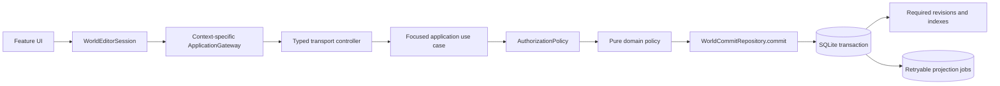
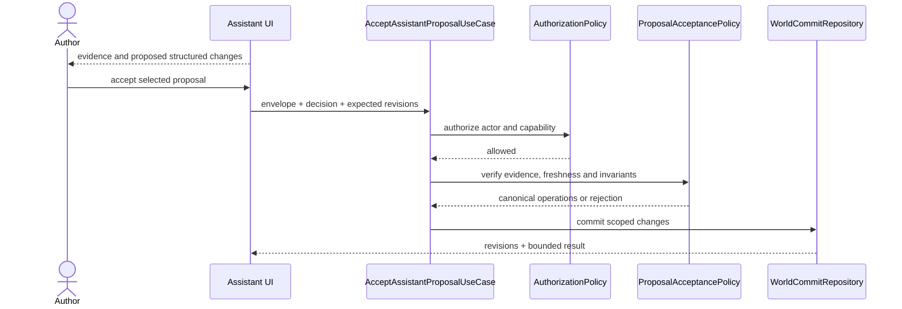
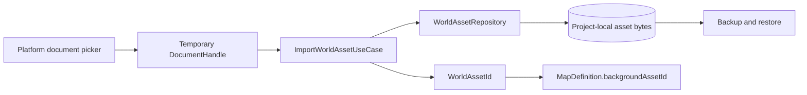

# Architecture implementation plan

Status: **normative delivery plan**

Approved: 30 August 2026

Scope: architecture sequencing, ownership decisions and implementation gates

This is the single authority for how Quiltor moves from the current codebase to
the target architecture. The target model and its detailed UML views explain
the intended seams, but their concrete class names remain proposed until a
vertical slice has passed the gate defined here.

Existing public contracts remain authoritative while a phase is in progress.
In particular, the versioned manuscript and Story World v1 document operations
are not replaced merely because a finer internal command is proposed.

## Critical review outcome

The target direction is sound, but the original implementation mechanics were
too broad for a local-first, predominantly single-author application. Quiltor
must preserve clear boundaries without adopting a distributed-system command
bus, a global world snapshot or a general event infrastructure before the
product demonstrates a need for them.

### Decisions retained

- Hosts, application use cases, domain policy and platform adapters remain
  separate.
- `RuntimeDependencies` are injected at composition roots; product modules do
  not select transports, databases, stores, operating-system adapters or model
  runtimes.
- `WorldEditorSession` is the client ownership boundary for one open world.
- Story World facts and author-owned layout are separate models.
- Native application operations and native platform capabilities use different
  bridges.
- Assistant inference is accessed through a Quiltor-owned port. Inference may
  propose, but only an explicit author decision through deterministic
  application policy may change canon.
- Build `TargetProfile` and embedded `RuntimeProfile` remain separate facts.

### Decisions corrected before implementation

1. Context-specific application ports and use cases replace a generic
   `ApplicationFacade`, global command bus and query dispatcher.
2. A command opens a scoped transaction over its actual read/write set. It does
   not hydrate a full manuscript and Story World into one
   `WorldProjectSnapshot` by default.
3. One `WorldCommitRepository.commit(CommitPlan)` owns the SQLite transaction.
   Canonical changes, aggregate revisions, idempotency receipts and required
   projection jobs are committed together.
4. Persistent reference/search data needed immediately is updated inside that
   transaction. After-commit jobs are reserved for retryable side effects such
   as file mirrors, remote backup upload or generated thumbnails.
5. A platform `DocumentHandle` is only an import capability. Canonical map data
   references a project-owned `WorldAssetId` whose bytes participate in backup
   and restore.
6. Assistant proposal acceptance always enters through an authorised
   `AcceptAssistantProposalUseCase`; no controller, router or Assistant module
   calls the deterministic core directly.
7. Client-only search, backlinks and navigation may include live drafts.
   Canonical Assistant context is built application-side from repository data.
   Unsaved selected text is either flushed first or supplied explicitly as
   bounded `DraftContext`.
8. Text history and Story World history remain separate mechanisms coordinated
   by one active-undo router. Save status is unified, but independent save lanes
   are retained; an atomic cross-document batch exists only for operations that
   genuinely modify both aggregates.
9. Pure deterministic rules move to Rust first. SQLite ownership moves only as
   one complete storage boundary after a mobile bridge and benchmarks justify
   it; Python and Rust never share canonical write ownership operation by
   operation.

## Corrected target flow

### Canonical product mutation

`Principal` and capability checks stay in the application layer. The domain
receives an `ActorId` only when the operation needs an audit or ownership fact.
Internal domain events may help a use case build its `CommitPlan`; they are not
part of the public client response. Responses contain the affected revisions,
touched stable IDs and, where useful, a bounded patch/read model.

### Assistant proposal acceptance

### Project asset import

The same rule applies to future project-owned media: external handles are
ingress values, not durable domain identity.

## Ownership model

| Owner                                                                       | Responsibility                                                                                | Explicitly not owned                                    |
| --------------------------------------------------------------------------- | --------------------------------------------------------------------------------------------- | ------------------------------------------------------- |
| `WorldEditorSession`                                                        | Active world, draft stores, save-status aggregation and active undo routing                   | Domain validation, SQLite, provider selection           |
| `ChapterDraftBuffer` and text history                                       | Keystroke latency, editor transactions and coalesced chapter saves                            | Story World operations                                  |
| Story World draft store and feature history                                 | Graph/map/timeline interaction drafts and inverse feature operations                          | Manuscript text history                                 |
| Context application use case                                                | Authorisation, capability policy and orchestration for one operation                          | Transport and concrete persistence                      |
| Domain aggregate/policy                                                     | Canonical invariants for the affected scope                                                   | UI drafts, identity sessions, model execution           |
| `WorldCommitRepository`                                                     | One atomic commit of canonical changes and commit metadata                                    | Provider selection and after-commit execution           |
| `WorldAssetRepository`                                                      | Project-owned asset bytes, metadata and backup participation                                  | Platform document handles                               |
| Client projection services                                                  | Draft-aware navigation, search and backlinks                                                  | Canonical Assistant evidence                            |
| Server `HistoryReader.chapter_comparison` and `SnapshotStore`               | Direct-parent resolution and stable-ID chapter reads from read-only immutable snapshot SQLite | Parent exposure in the log, positional lookup or writes |
| Client History `diffVersionText` (target role: `ChapterTextDiffProjection`) | Pure comparison of available adjacent records that preserves exact text for presentation      | Snapshot traversal, draft history, saves or canon       |
| Manuscript binder and chapter-turn UI                                       | Root indentation and the 425 ms previous/next interaction threshold                           | Tree hierarchy, document revisions or history           |
| Assistant context service                                                   | Repository-backed, revision-bound Assistant evidence                                          | Client navigation state                                 |
| Inference port                                                              | Provider-neutral request, result and capabilities                                             | Canonical mutation                                      |

Settings are split deliberately:

- `WorldMetadata`: world identity and descriptive metadata;
- `WritingSettings`: writing locale, dictionary and writing symbols;
- `UserPreferences`: theme, panel layout and inference preference;
- `RuntimeProfile`: immutable facts embedded in a built artifact.

Persisted Story World layout contains author data such as positions, locks,
favourites and map calibration. Zoom, pan, hover and selection remain ephemeral
viewport state.

## Data and performance policy

- Full v1 documents remain supported wire/load/save contracts during the early
  phases. They are compatibility boundaries, not a requirement to copy a whole
  world for every interaction.
- Manuscript and Story World keep independent aggregate revisions. An optional
  monotonic world commit sequence may later order a change feed, but unrelated
  text and layout changes must not conflict merely because they share a world.
- Text is saved as a coalesced chapter/document lane. Structural Story World
  operations may adopt typed commands where they provide real validation,
  conflict or Assistant-acceptance value.
- Chapter-level lazy loading, paging and finer aggregates are introduced only
  after representative large-world benchmarks show that the existing boundary
  misses an agreed product budget.
- Per-commit full snapshots are not the default history model. Use a compact
  change log plus periodic/manual named checkpoints when recovery requirements
  demand them.
- No high-frequency keystroke or pointer-move path crosses FFI synchronously.

Before a scaling change is accepted, the benchmark must cover at least:

- a representative long manuscript;
- a dense Story World graph and timeline;
- cold open, chapter switch, search, autosave and recovery;
- desktop and the slowest supported mobile profile;
- peak memory as well as elapsed latency.

## Implementation phases and gates

Each phase is independently releasable. A planned rule becomes enforced in
architecture checks only after its vertical slice is present in production
code.

### Phase 0 — align contracts and ownership

Deliver:

- this plan and consistent UML reference views;
- explicit owners for assets, settings, projections and histories;
- ADRs for any later command-bus, storage-cutover or persistent-job decision;
- representative performance fixtures and budgets before aggregate splitting.

Exit gate: documentation has one non-contradictory authority chain and the
architecture checker rejects the retired assumptions.

### Phase 1 — simplify client composition

Deliver:

- injected `RuntimeDependencies` and no mutable runtime singleton;
- one `WorldEditorSession` per open world;
- focused feature controllers/selectors;
- separate text and Story World histories plus active-undo coordination;
- save-status aggregation over independent save lanes;
- a read-only server History port that resolves the selected snapshot and its
  direct parent internally, reads both by stable `ChapterId` from immutable
  snapshot SQLite, and returns explicit `available`/`exists`/`text` records
  without exposing parent metadata in the history log;
- a deterministic client History projection that preserves exact whitespace
  and line breaks without normalization and renders removed/added presentation
  without a canonical write;
- binder root indentation and the 425 ms previous/next chapter threshold as
  tested Manuscript presentation policies.

Exit gate: existing UI behaviour and v1 contracts remain green; drafts cannot
mutate canonical state outside an application gateway. Chapter-version tests
prove server-side direct-parent selection, stable-ID lookup across rename and
reorder, explicit unavailable/non-existing states, immutable read-only access,
stable diff output, semantic removed/added markup and zero save calls. Contract
tests prove that the log does not expose parent metadata. Diff tests reconstruct
both input strings exactly and cover the bounded large-rewrite fallback. Binder
tests prove depth-zero alignment on regular and compact layouts, and
chapter-turn transition tests prove the 425 ms threshold.

### Phase 2 — make current persistence safe

Deliver:

- atomic existing document saves with revisions and idempotency receipts;
- project-local `WorldAssetId` import, backup and restore;
- transactional immediate indexes;
- bounded retry jobs only for genuine after-commit side effects.

Exit gate: crash/failure tests prove there is no committed database state with
an acknowledged but lost required projection, and imported maps survive move,
backup and restore.

### Phase 3 — introduce typed structural operations where valuable

Deliver:

- typed Story World operations and expected revisions;
- scoped read/write transactions and bounded results;
- authorised `AcceptAssistantProposalUseCase` through the same mutation path;
- cross-document atomic commits only for genuine cross-document operations.

Exit gate: no duplicated canonical validation exists in client, Python and
Rust, and stable v1 document round-trips still pass.

### Phase 4 — establish projection ownership

Deliver:

- client draft projections for navigation/search/backlinks;
- repository-backed, revision-bound Assistant context;
- an explicit flush-or-`DraftContext` rule for unsaved selections;
- shared pure projection fixtures where client and backend semantics overlap.

Exit gate: the Assistant cannot accidentally consume mutable client state, and
search/navigation continue to include the author's current draft.

### Phase 5 — isolate inference

Deliver:

- Quiltor-owned request/result/capability types;
- `AssistantInferencePort` plus one current-provider adapter;
- explicit privacy/consent policy for any remote execution.

Exit gate: Assistant product code contains no provider, executable, URL or
model-path decision. A registry, package manager or automatic selector is added
only when a second provider or installable model creates a real requirement.

### Phase 6 — validate and, if justified, migrate the portable core

Deliver in order:

1. pure deterministic rules with shared cross-runtime fixtures;
2. high-level FFI DTOs and a real mobile bridge prototype in simulator CI;
3. latency, memory, cancellation and lifecycle measurements;
4. an explicit go/no-go ADR for moving the complete World Storage boundary.

Exit gate: if the cutover proceeds, exactly one runtime owns SQLite writes,
migrations and transaction lifecycle. If the measured benefit is insufficient,
the portable policy core remains the supported design without forcing a storage
rewrite.

## Trigger-based decisions

The following are not implementation prerequisites:

| Mechanism                         | Trigger required before adoption                                                          |
| --------------------------------- | ----------------------------------------------------------------------------------------- |
| Generic command/query bus         | Dynamic handlers or plugins that cannot be served by explicit use cases                   |
| Durable general event bus         | More than bounded local retry jobs and a demonstrated multi-consumer requirement          |
| Finer chapter aggregates/paging   | Representative benchmarks miss an agreed latency or memory budget                         |
| World-wide change feed            | Supported multi-window/synchronisation behaviour requires ordered incremental consumption |
| Provider registry/package manager | A second provider or user-installable model is approved                                   |
| Rust SQLite ownership             | Mobile prototype and benchmarks approve the complete storage-boundary cutover             |

## Validation and traceability

The current UI-polishing requirements remain feature-local and trace to Phase
1 as follows:

| Requirement                                                                      | Current evidence                                                                                                                                                                                                                                                                                                    | Target owner                                                                                                                                                                                                                                                                              | Verification                                                                                                                                                                                                                                                                                                                        |
| -------------------------------------------------------------------------------- | ------------------------------------------------------------------------------------------------------------------------------------------------------------------------------------------------------------------------------------------------------------------------------------------------------------------- | ----------------------------------------------------------------------------------------------------------------------------------------------------------------------------------------------------------------------------------------------------------------------------------------- | ----------------------------------------------------------------------------------------------------------------------------------------------------------------------------------------------------------------------------------------------------------------------------------------------------------------------------------- |
| Fassungsansicht compares a selected chapter revision with its direct predecessor | `useChapterHistory` calls `chapterComparison(ref, current.id)`; server `HistoryReader`/`SnapshotStore` resolves the private parent and returns selected/previous `available`/`exists`/`text`; client History `diffVersionText` preserves exact inputs and the panel renders `<del>`/`<ins>` or an unavailable state | Manuscript owns revision/chapter selection; server History owns adjacency and stable-ID snapshot reads; client History owns the pure projection role; `ChapterTextDiffProjection` remains a proposed class name until its phase gate is enforced; Design owns semantic diff/status tokens | fixtures for rename/reorder, direct parent, oldest revision, missing parent, legacy/missing snapshot database, absent chapter, added, removed, unchanged and repeated text; assert no parent in the log, read-only immutable access, exact whitespace/line-break reconstruction, bounded fallback, stable markup/tokens and no save |
| Top-level chapter-tree indentation is visually unambiguous                       | `ChapterTreeRows` exposes `data-binder-depth`; binder CSS maps depth and nested containers to padding/guides                                                                                                                                                                                                        | Manuscript binder CSS owns the root baseline and nested step; Design supplies spacing/line tokens                                                                                                                                                                                         | regular, compact and nested-tree component/layout tests; no serialized `ManuscriptTree` change                                                                                                                                                                                                                                      |
| Previous/next chapter scrolling reacts in half the current hold duration         | `chapterOverscroll.ts` owns the pure 850 ms hold state; `EditorSurface` executes navigation                                                                                                                                                                                                                         | Manuscript `ChapterOverscrollPolicy` uses 425 ms; `ChapterTurnAffordance` renders progress; Design supplies decorative motion tokens                                                                                                                                                      | deterministic timestamp tests at 424/425 ms, direction reset, boundary loss and mouse re-grip grace; reduced-motion visual test                                                                                                                                                                                                     |

None of these rows introduces a global UI service, domain command, persistence
field or cross-feature abstraction. They can ship independently of the larger
session migration while retaining the ownership direction documented by the
client-runtime view. The current server History port already owns snapshot
adjacency and the current client History module function owns text projection.
The UML result/projection class names are target responsibility labels, not
production APIs enforced by today's architecture checks.

- Architecture documentation checks verify links, authority status and the
  corrected invariants in this plan.
- Code boundary checks are enabled only as the corresponding phase moves from
  `planned` to `enforced`; planned class names are not tested as production
  APIs.
- Contract, migration, backup/restore, crash consistency, browser, mobile and
  cross-runtime fixture tests remain release gates.
- The [target component model](target-component-model.md) and its detailed
  [views](views/) illustrate this plan. If a proposed class diagram conflicts
  with this file, this file wins until an ADR explicitly changes it.
- The [product roadmap](../TODO.md) and local agent task breakdowns may
  decompose these phases into tasks, but they may not silently change their
  ownership or gates.

## Deliberately rejected default designs

- a global `ApplicationFacade` that routes every product operation;
- a generic command/query dispatcher without a demonstrated dynamic-handler
  requirement;
- a full `WorldProjectSnapshot` for every edit;
- public `DomainEvent[]` responses to the client;
- an outbox for every derived read model;
- a full snapshot after every commit;
- provider installation/selection machinery before another provider exists;
- operation-by-operation transfer of SQLite write ownership between Python and
  Rust.

These mechanisms may be reconsidered through an ADR when their trigger is met.
