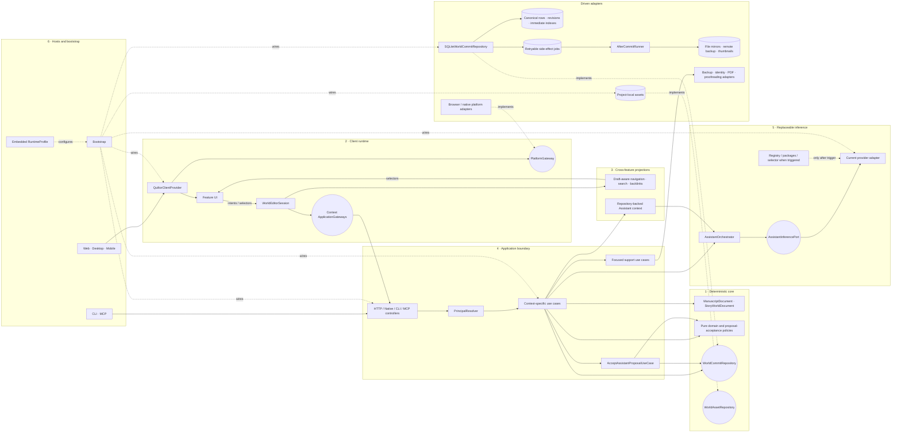

# Target architecture model

Status: **normative boundaries with proposed class-level reference views**

Review basis: repository state reviewed on 30 August 2026

This document is the entry point to Quiltor's target structure. Its ownership
boundaries and dependency rules are normative. Concrete class names in the UML
views are proposed reference designs until a vertical slice passes the gate in
the [architecture implementation plan](implementation-plan.md). The plan is the
single authority for sequencing, migration gates and deliberately deferred
mechanisms.

The model is split into focused UML views because a single diagram cannot
remain useful as a class model, runtime trace, persistence model and build map
at the same time. The final diagram on this page deliberately shows only the
stable seams between the detailed views.

The target is a local-first modular monolith with several hosts. It is not a
microservice plan. A process boundary exists only for an independently deployed
service or a replaceable local capability such as inference.

## Reading order

| Order | Question                                                                        | Document                                                            |
| ----- | ------------------------------------------------------------------------------- | ------------------------------------------------------------------- |
| 0     | In which order may the architecture be implemented, and what gates each phase?  | [Architecture implementation plan](implementation-plan.md)          |
| 1     | Which owners may change canon?                                                  | [Core software and domain model](views/core-software.md)            |
| 2     | What happens between a UI action, undo/redo and persistence?                    | [Client runtime and world session](views/client-runtime.md)         |
| 3     | How do notes, references, search and Assistant context avoid feature cycles?    | [Cross-feature projections](views/cross-feature-projections.md)     |
| 4     | How are operations authorised and committed atomically?                         | [Application and persistence](views/application-and-persistence.md) |
| 5     | How can model/runtime options change without coupling them to the product?      | [Assistant and inference](views/assistant-and-inference.md)         |
| 6     | How do web, desktop, mobile, CLI, installers and stores fit around the product? | [Hosts and distribution](views/hosts-and-distribution.md)           |
| 7     | Which stable ports connect all six views?                                       | [Integrated target map](#integrated-target-map)                     |

Each detailed view proposes a coherent class-level implementation. The
implementation plan owns delivery truth; the integrated map is an index of
stable interactions, not a second copy of the proposed classes.

## Notation

- Every unqualified class in a diagram is a **proposed target** class. Mapping
  tables explicitly identify current implementation names. A proposed class is
  not mandatory until its phase is implemented and enforced.
- A composition arrow means lifecycle ownership. An ordinary arrow means a
  call, command or query through the label on that edge.
- `<<interface>>` is a consumer-owned port. Concrete adapters point toward the
  port they implement.
- Boundary DTOs, domain entities and UI read models are different types even if
  their fields happen to match today.
- Cross-aggregate references are stable IDs/value objects, never in-memory
  object references.

## Current-state assessment

The repository already has foundations worth preserving: host-owned composition
roots, public frontend module barrels, Python application/port separation,
versioned contracts, a visible design system and distribution profiles. The
remaining gaps explain why the target introduces the classes in the detailed
views.

| Area               | Current implementation                                                                                                                                            | Target correction                                                                                                                                                                               |
| ------------------ | ----------------------------------------------------------------------------------------------------------------------------------------------------------------- | ----------------------------------------------------------------------------------------------------------------------------------------------------------------------------------------------- |
| Client composition | `Application.tsx` owns session loading, two histories, autosave, navigation, overlays and reference indexes. Feature code reads a mutable global `quiltorClient`. | Injected `RuntimeDependencies` and a keyed `WorldEditorSession` make ownership explicit. Text and Story World keep separate histories/save lanes behind one status and active-undo coordinator. |
| Frontend modules   | Manuscript, Story World, Notes and World References form an import cycle. Gateways import feature model types back from modules.                                  | Neutral command, projection and boundary contracts form a declared module DAG. Feature UI never imports another feature's UI or aggregate internals.                                            |
| Story World        | `FigureState`, `FigureNode` and `FigureEdge` also contain places, timeline, presence, calendars and layouts.                                                      | `StoryWorldDocument`, `WorldElement` and `WorldRelationship` become truthful names. Figures, Places and Timeline are projections of one document.                                               |
| Backend            | Context use cases exist, but URL-selected route-service bundles use `Any`; identity still knows HTTP concepts; CLI/MCP can repeat policy.                         | Typed controllers call context-specific, transport-neutral use cases. Delivery resolves a `Principal`; all hosts reuse the same application policy without a global routing facade.             |
| Persistence        | Cross-document validation, SQLite save and file-mirror writes are not one atomic unit.                                                                            | A scoped `CommitPlan` atomically writes canonical changes, revisions and required jobs. Immediate indexes stay transactional; retry jobs are limited to genuine side effects.                   |
| Portable core      | Rust currently owns timeline ordering and an FFI contract-version function only. Python/SQLite remains canonical.                                                 | Pure deterministic policies move first. A complete SQLite ownership cutover is benchmark- and mobile-milestone-gated; Python and Rust never split canonical writes per operation.               |
| Inference          | `InferenceEngine` exposes provider identity, lifecycle and raw dictionaries to product code. Selection is an OS/environment heuristic.                            | `AssistantInferencePort` speaks Quiltor-owned request/result types. A separate control plane owns provider selection, packages, hardware, preferences and consent.                              |
| Hosts/distribution | Native application operations and device capabilities can be conflated; source profiles and runtime facts are easy to blur.                                       | Application Bridge, Platform Bridge, source `TargetProfile` and embedded `RuntimeProfile` are four separate contracts. Publishers remain build-time adapters.                                   |

## Non-negotiable rules

1. **One canonical owner per rule.** UI projections may format state but never
   reimplement validation, chronology, reference resolution or proposal
   acceptance.
2. **Dependencies point inward.** Hosts and adapters depend on ports; use cases
   depend on domain policy and ports; domain code depends on no transport,
   persistence, platform or model runtime.
3. **Bootstrap is the concrete assembler.** Product modules never select an
   HTTP client, native bridge, database, OS adapter, store SDK, model or runtime.
4. **Cross-feature interaction is explicit.** Features exchange typed intents,
   stable IDs and immutable read models. Internal domain events are not a
   public client integration contract.
5. **Contracts are boundary DTOs, not domain models.** Versioned wire DTOs are
   mapped at the boundary and do not become the internal object graph.
6. **Local-first is capability-based.** Host, platform, distribution,
   entitlement and hardware are separate inputs. Unsupported capabilities are
   absent rather than present-but-broken.
7. **AI never owns canon.** Inference may interpret and propose. Deterministic
   core policy verifies a proposal, and only an explicit author command applies
   it.
8. **One atomic commit owner.** Canonical changes, revisions, idempotency
   receipts and required jobs commit through one repository transaction.
   Immediate indexes update transactionally; only retryable side effects run
   after commit.
9. **No dual storage authority.** Pure policies may move between runtimes behind
   fixtures. SQLite writes, migrations and transaction lifecycle move only as
   one complete boundary after the mobile and benchmark gate approves it.
10. **Complexity needs a trigger.** A generic bus, global snapshot, durable
    event infrastructure, provider registry or finer aggregate is not a default
    target class. Its trigger and ADR must precede adoption.

## Stable ownership map

| Owner                        | Owns                                                                                                   | Does not own                                                           |
| ---------------------------- | ------------------------------------------------------------------------------------------------------ | ---------------------------------------------------------------------- |
| `WorldEditorSession`         | Active world ID, draft stores, coordinated histories, revisions, save status and client projections    | Domain validation, transport selection, SQLite or provider selection   |
| `ManuscriptDocument`         | Chapters, folders, tree order, text marks, mentions, notes and story-time anchors                      | Timeline moments or world elements                                     |
| `StoryWorldDocument`         | Story facts plus persisted author layout, with facts and layout modelled separately                    | Manuscript text or ephemeral viewport state                            |
| Context application use case | Authorisation, capability checks and orchestration for one operation                                   | Generic routing, HTTP, cookies, concrete databases or model processes  |
| Domain policy/aggregate      | Deterministic invariants for the affected scope                                                        | UI drafts, identity sessions, model lifecycle or transaction selection |
| `WorldCommitRepository`      | One SQLite transaction for canonical changes, revisions, receipts, immediate indexes and required jobs | After-commit execution or provider selection                           |
| `WorldAssetRepository`       | Project-owned media bytes and metadata included in backup/restore                                      | Platform `DocumentHandle` values                                       |
| Assistant product            | Conversation, repository-backed evidence, read tools, proposals and author-decision workflow           | Runtime installation, model files, credentials or canonical mutation   |
| Inference adapter            | Provider-neutral execution through `AssistantInferencePort`                                            | Story semantics and proposal acceptance                                |
| Host bootstrap               | Construction of concrete ports from the embedded runtime profile                                       | Product policy                                                         |
| Distribution tooling         | Build profile, packaging, signing and publishing                                                       | Runtime feature decisions                                              |

## Allowed top-level interactions

| Caller                           | May call                                                                  | Contract                                                               |
| -------------------------------- | ------------------------------------------------------------------------- | ---------------------------------------------------------------------- |
| Feature UI                       | Its feature controller and UI platform ports                              | Typed UI intent and read models                                        |
| Feature controller               | Its draft store and `WorldEditorSession`                                  | Feature intent/query types                                             |
| `WorldEditorSession`             | A context-specific `ApplicationGateway`                                   | Existing versioned documents plus typed operations introduced by phase |
| HTTP/native/CLI/MCP controller   | Its context use case after principal resolution                           | Versioned application request/response DTOs                            |
| Context use case                 | Authorisation/capability policy, domain policy and focused outbound ports | Operation-specific types                                               |
| Domain policy                    | A scoped transaction read model                                           | Domain values; internal events never become public responses           |
| `WorldCommitRepository`          | SQLite transaction                                                        | `CommitPlan` and bounded `CommitResult`                                |
| Assistant orchestrator           | Application-owned read tools and `AssistantInferencePort`                 | Revision-bound evidence; proposals only                                |
| `AcceptAssistantProposalUseCase` | Authorisation and deterministic acceptance policy                         | Accepted envelope through the normal mutation path                     |
| After-commit runner              | Committed retry jobs                                                      | Idempotent external side effects only                                  |
| Bootstrap                        | Hosts, adapters and embedded `RuntimeProfile`                             | Construction only                                                      |

Any top-level interaction not represented here or in a detailed view requires
an explicit port or an architecture decision. Convenience imports are not an
exception.

## Implementation plan

The normative sequence, entry/exit gates, deliberately deferred mechanisms and
Rust/mobile decision points live only in the
[architecture implementation plan](implementation-plan.md). Do not copy a
second migration order into a UML view or the technical TODO.

In short: simplify client composition, make the current persistence boundary
atomic, add assets/settings ownership, introduce scoped typed operations only
where valuable, separate canonical Assistant context, isolate inference, and
move SQLite ownership only after the complete mobile/benchmark gate approves
it. Every phase preserves the public contract while it is in flight.

## Integrated target map

This last diagram composes the six detailed views. It intentionally contains
ports and owners only; class internals stay in the linked UML documents.

The only intended cross-view paths are the labelled ports above. In particular,
feature UI does not reach storage, deterministic policy does not reach a model
runtime, client projections do not become canonical Assistant evidence, and
inference does not reach canonical aggregates.
