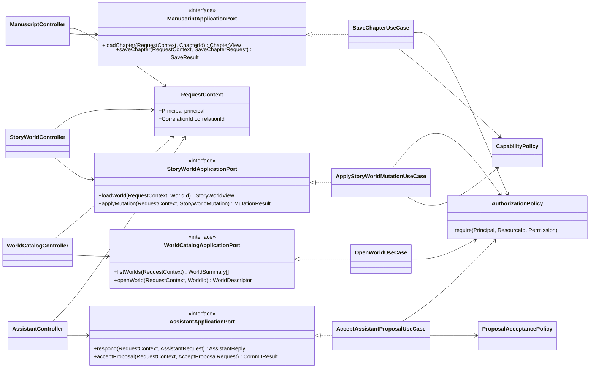
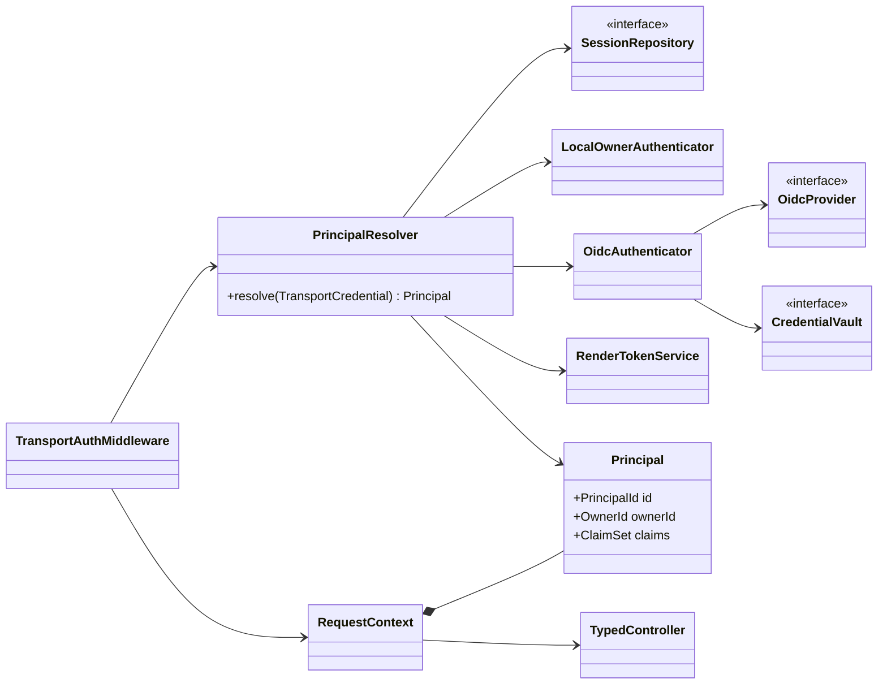
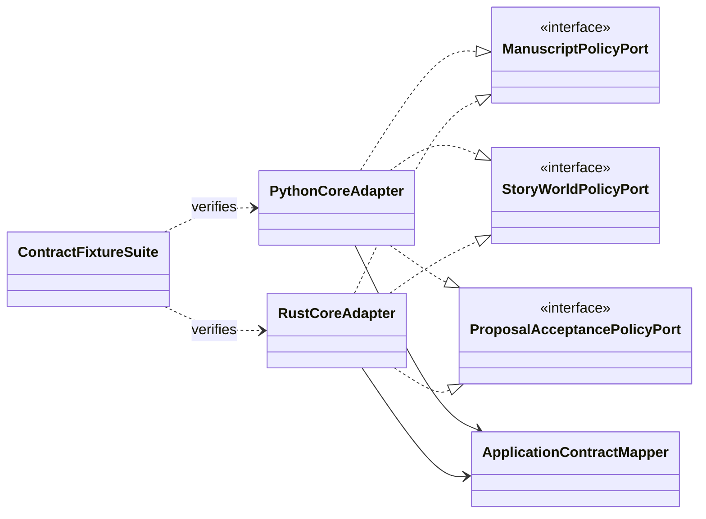
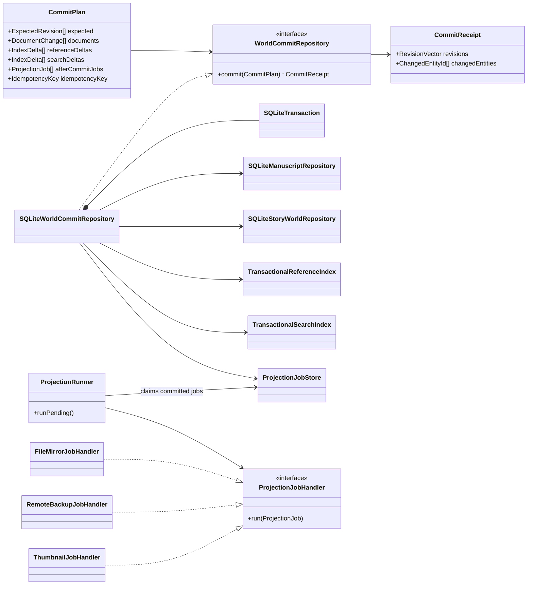
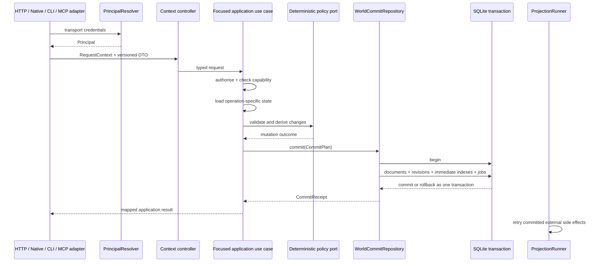

# Application, identity and persistence

Status: **proposed target view**

Answers: **How does a transport-neutral request reach a focused use case, and
what is committed atomically?**

The boundaries and invariants in this view are normative. Class names and the
exact decomposition are a reference for migration and may be refined by code
feedback. Quiltor uses context-specific application ports and use cases; it does
not introduce a global `ApplicationFacade`, generic command bus or service
locator.

## Delivery and application boundaries

The concrete ports are grouped into the namespaced `ApplicationGateway` already
used by the client. A controller maps a versioned transport DTO to exactly one
use case. A use case authorises the request, loads only the state needed for the
operation, invokes deterministic policies and commits through the persistence
port. It does not route by path, expose service instances or dispatch an
unbounded generic command.

The current versioned full-document GET/PUT contracts remain valid migration
inputs. Typed mutations are introduced where they capture real structural
intent, such as Story World changes and Assistant proposal acceptance. Text
editing may continue to use a coalesced chapter/document save instead of
creating a command per keystroke.

## Identity and authorisation

Authentication ends before a typed controller is invoked. Product identity
classes never inspect cookies, headers, redirect query parameters or HTTP
handlers.

The local single-author mode is an authenticator implementation, not a branch
inside every use case. Authorisation is an application concern. Deterministic
core policies receive an `ActorId` only if audit or domain semantics require it;
they do not receive transport identity objects.

## Portable-core bindings

Application use cases consume focused core policy ports. Bindings are adapters;
they do not expose Rust aggregate memory or require a host to choose individual
domain functions.

Pure deterministic policies can move behind these ports after shared fixtures
exist. Storage ownership is different: Python and Rust must never migrate
SQLite writes operation by operation. One runtime owns the complete persistence
boundary for a target profile. A Rust storage cutover is considered only at a
concrete native/mobile milestone and happens as one measured boundary change.

## Atomic persistence and immediate indexes

`WorldCommitRepository.commit(CommitPlan)` guarantees one SQLite transaction.
Changed documents, expected/new revisions, the idempotency receipt, immediately
required FTS/reference-index deltas and durable after-commit jobs either all
commit or all roll back.

`projection_jobs` is not a general domain-event bus. It is reserved for real
side effects that cannot participate in the SQLite transaction, such as file
mirrors, remote backup uploads and generated thumbnails. Handlers are
idempotent and retryable. Search and reference indexes required by the next
request are updated transactionally, not eventually by a runner.

## Canonical mutation sequence

There is no global world lock and no requirement to hydrate a complete
`WorldProjectSnapshot` for every operation. Each use case declares its read and
write set; cross-document invariants load both sides only when necessary.
Unrelated worlds and unrelated revision lanes can commit concurrently.

## Current code to target responsibility

| Current code                                                | Target class/responsibility                                     |
| ----------------------------------------------------------- | --------------------------------------------------------------- |
| `WebApplication.route_services(path)`                       | typed controller registration and focused port injection        |
| client namespaced `ApplicationGateway`                      | retained public grouping of context-specific application ports  |
| route-service dataclasses typed as `Any`                    | explicit controller constructor ports                           |
| `Identity.resolve(handler)` and HTTP-aware identity service | transport middleware plus `PrincipalResolver`                   |
| `DocumentRepository` with raw `Path`/`dict`                 | owned repository values behind focused use cases                |
| `DocumentUseCases.save`                                     | save use case plus atomic `WorldCommitRepository`               |
| database commit followed by mirror write                    | transactional `projection_jobs` plus idempotent side-effect job |
| rebuilt FTS/reference data after commit                     | `IndexDelta` written inside the document transaction            |
| one global web lock                                         | optimistic revisions and operation-scoped transaction locking   |
| current `quiltor-core` timeline function                    | one deterministic policy behind a focused port                  |
| FFI contract-version function only                          | versioned high-level policy calls after contract fixtures exist |

## Support-service outbound ports

Support use cases consume focused ports owned by their application context:

- backup repository and remote backup gateway;
- history reader, change log and named snapshot store;
- OIDC provider, session repository and credential vault;
- asset import, document selection/handles and PDF renderer;
- proofreading dictionaries/services;
- commerce receipt/licence verification;
- lifecycle, scheduling, updates, diagnostics and observability.

Concrete platform, store or vendor names occur only in adapters and bootstrap.
