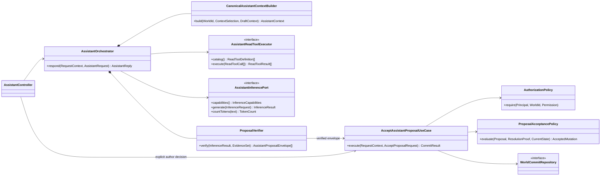
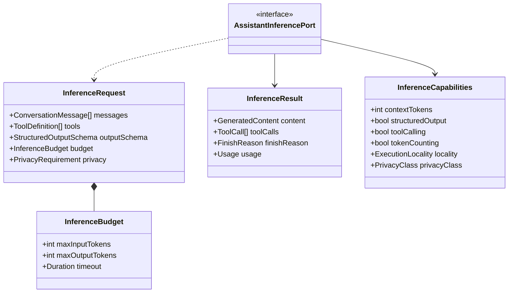
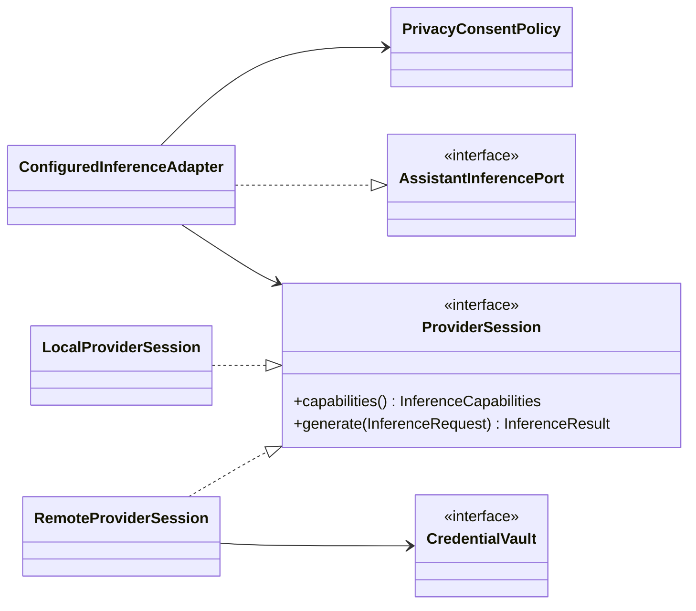
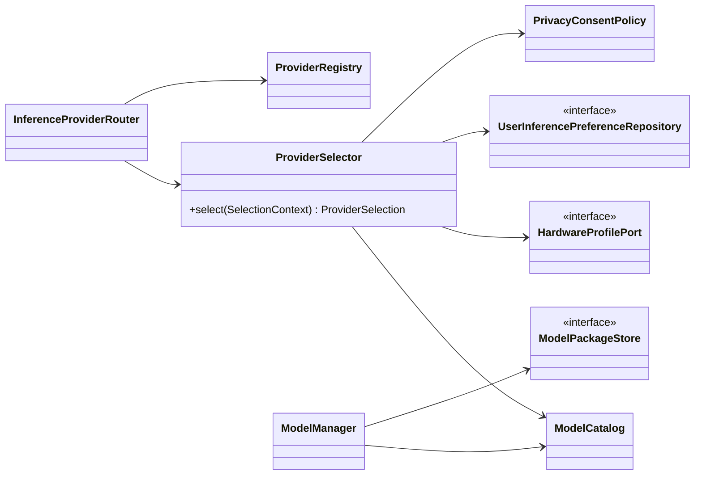
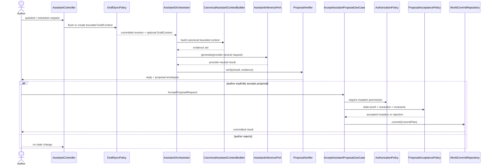

# Assistant and replaceable inference

Status: **proposed target view**

Answers: **How does Quiltor use AI without coupling product behaviour to a
model/runtime, while introducing only the infrastructure the product needs?**

The Assistant product and inference execution are separate modules joined by a
consumer-owned port. This seam is required now. A multi-provider registry,
automatic selector and model-package control plane are optional extensions and
are introduced only when a second supported provider, user-installable model or
distribution requirement creates the need.

## Product-side Assistant and acceptance

`ProposalVerifier` checks response shape, declared evidence and proposal bounds.
It does not authorise a mutation. Every accepted proposal travels through
`AcceptAssistantProposalUseCase`, even when inference and the application run in
the same process. The use case requires an explicit author decision, applies
`AuthorizationPolicy`, then applies deterministic `ProposalAcceptancePolicy`
checks for stale proofs, entity resolution and domain invariants before committing through
the normal atomic persistence path. Rejection creates no mutation.

The canonical context builder belongs to the Assistant application/backend
side. It reads committed canonical read models. Unsaved editor content is either
flushed before the request or supplied as an explicit, bounded `DraftContext`;
the Assistant never silently consumes a client-only projection as canonical
world state.

## Product-owned inference contract

These values contain no provider, URL, executable, process or model-path field:

Product policy adapts to reported capabilities. It does not assume one fixed
context window or use a runtime name to choose behaviour.

## Required provider seam

The composition root injects one configured provider session. Local execution
is the default. Remote execution is eligible only after an explicit user choice,
current consent for the privacy class and a credential stored in the vault.
Adding this port now keeps Assistant semantics independent without prematurely
building a provider marketplace.

## Trigger-based provider selection and control plane

The following is a **conditional reference design**, not required baseline
infrastructure. Introduce it when at least one of these triggers exists:

- two provider/model options are supported as product choices;
- users can install or remove model packages;
- hardware compatibility requires deterministic option selection;
- a distribution channel exposes a materially different model catalogue.

When activated, selection is deterministic and explainable: the result includes
the chosen option and rejection reasons for incompatible alternatives. Package
installation remains a settings/control-plane workflow, never an Assistant
conversation operation. Store builds may restrict packages while direct builds
allow verified downloads; the Assistant product sees only capabilities.

## End-to-end Assistant sequence

Read-tool calls are validated and evidence-bound inside the orchestration loop.
They do not create an alternate write route.

## Current code to target responsibility

| Current code                                                  | Target class/responsibility                                                   |
| ------------------------------------------------------------- | ----------------------------------------------------------------------------- |
| `InferenceEngine.identity/status/reload/close/invoke(dict)`   | `AssistantInferencePort` plus host-owned provider lifecycle                   |
| fixed product context assumptions                             | `InferenceCapabilities` and `InferenceBudget`                                 |
| OS/environment heuristic for llama.cpp versus MLX             | composition-selected provider now; `ProviderSelector` only after a trigger    |
| `AssistantInstallation`                                       | conditional settings control plane when user-installable packages are offered |
| raw installation/provider state in Assistant UI               | dedicated inference settings read model, when the control plane exists        |
| client-side aggregate cloning in `applyAssistantProposals`    | `AcceptAssistantProposalUseCase` through authorisation and acceptance policy  |
| `ResolutionProof`, `EnsureDecision`, `WorldResolutionContext` | deterministic `ProposalAcceptancePolicy`                                      |
| client-built Assistant knowledge projection                   | canonical backend builder plus explicit `DraftContext`                        |
| `AssistantJobStore`, progress and interaction logging         | Assistant infrastructure independent of provider selection                    |

Adding a provider always requires a conforming `ProviderSession` adapter and
contract tests. It requires a registry or package manager only after the stated
product triggers occur.
