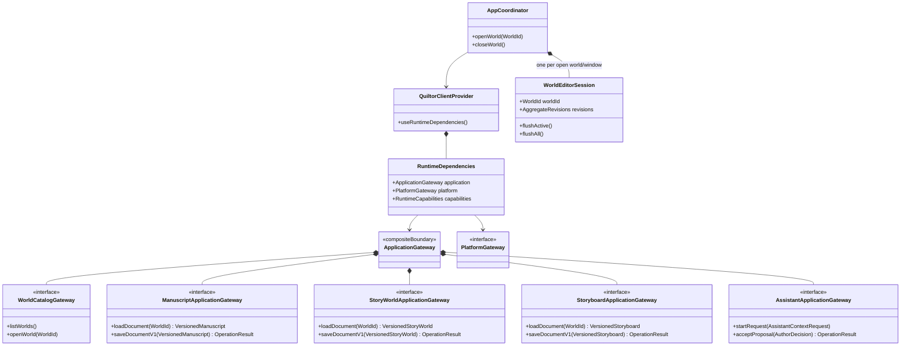
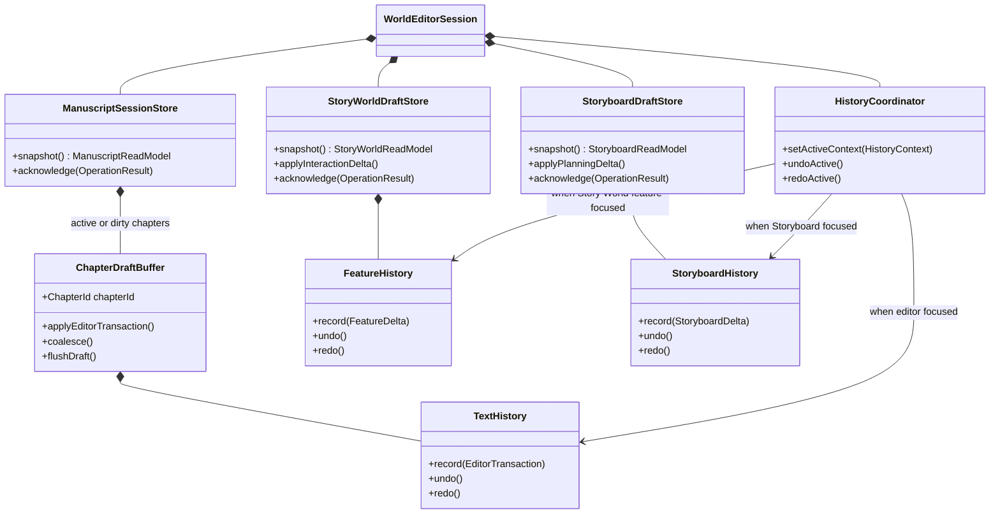
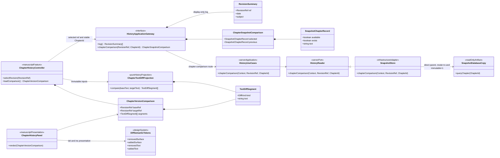
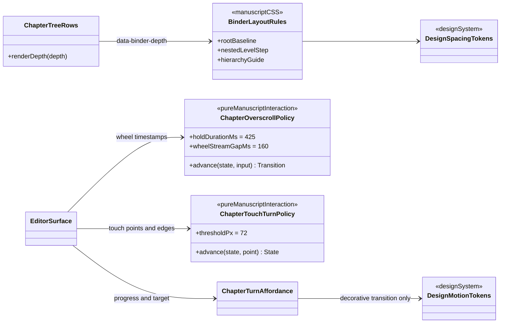
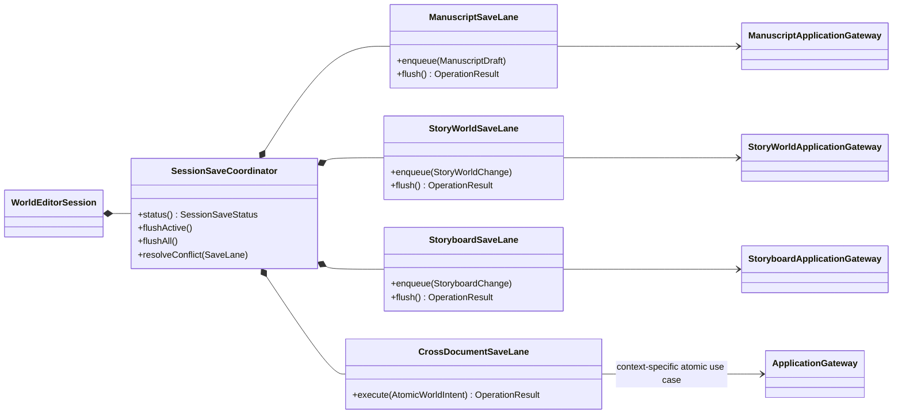
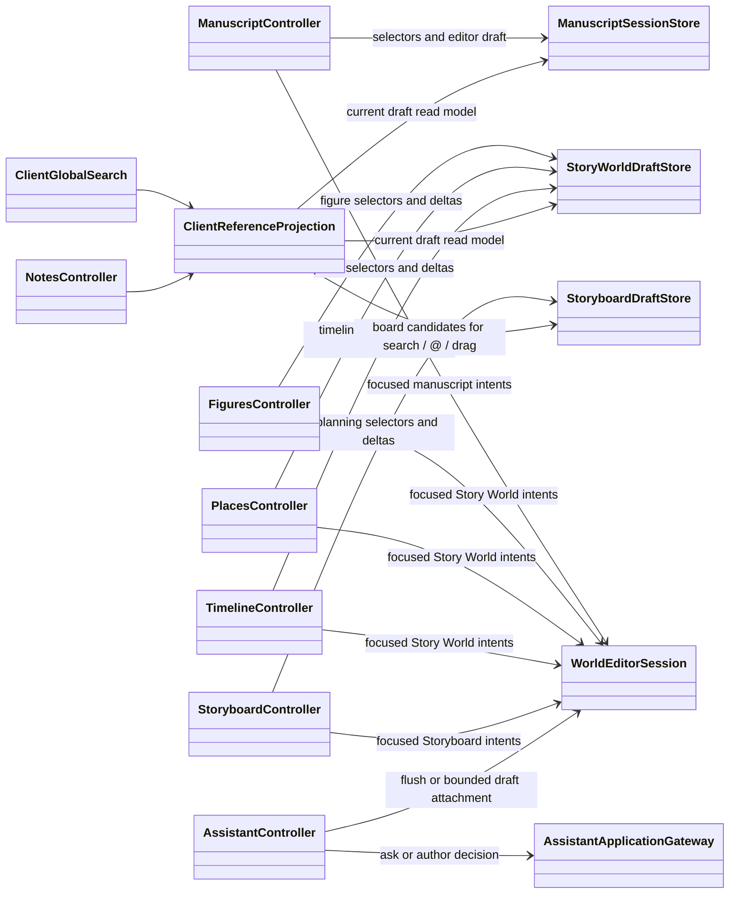
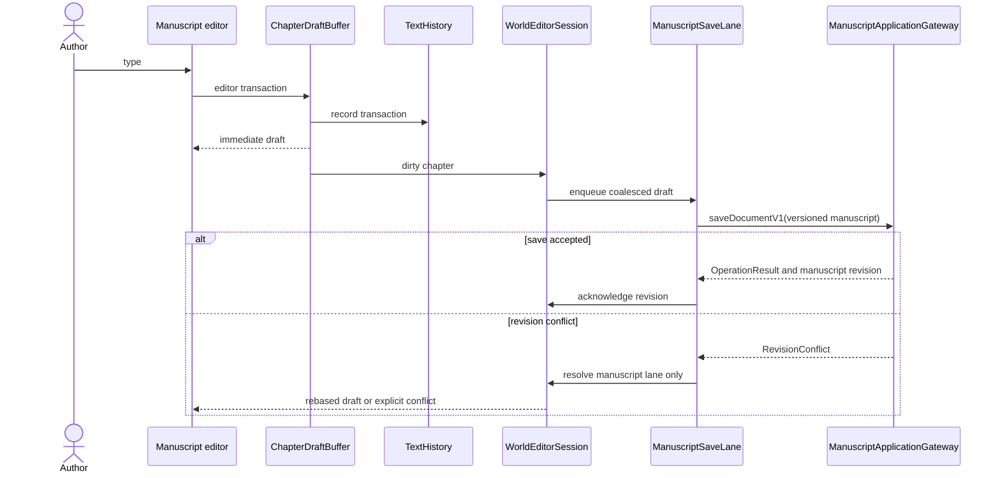
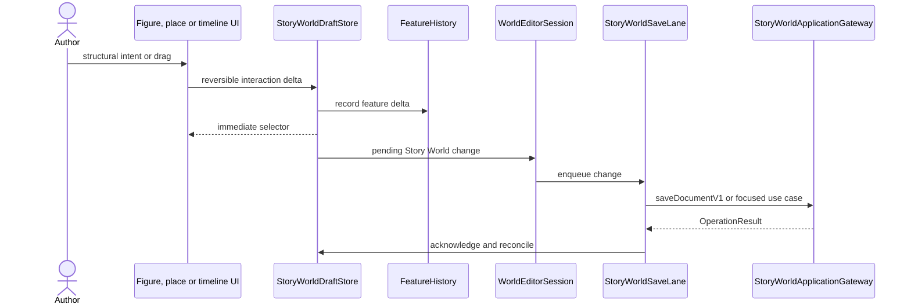
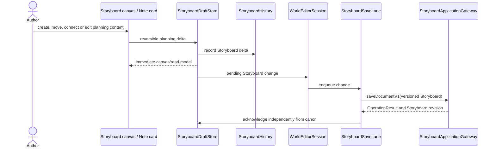
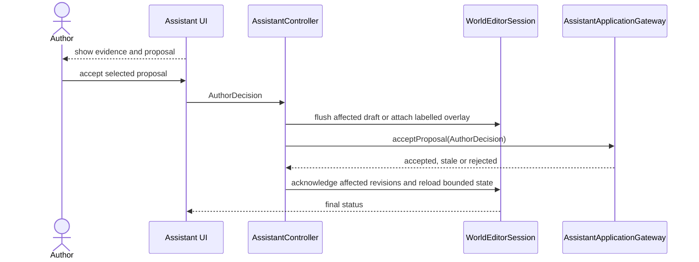

# Client runtime and world editor session

Status: **proposed target view**

Answers: **Which client boundary owns an open world, and how do responsive
drafts, undo and persistence cooperate without becoming a second domain?**

This view fixes ownership and dependency direction without prescribing one
React class for every box. <code>WorldEditorSession</code> is the reference name;
<code>WorldSession</code> is an acceptable shorter implementation name.

The client owns editable drafts, interaction state and presentation history. It
does not own canonical domain rules. Existing versioned full-document
application contracts remain the transition path while focused use cases are
introduced where they add concrete value.

## Composition and session ownership

Runtime dependencies are injected once. The application gateway is a small
composition of context-specific ports, not a universal
<code>execute(anyCommand)</code> facade.



The session is the ownership boundary for everything tied to one open world:
loaded versioned documents, dirty state, revisions, save status and the active
history context. Feature components receive selectors and focused controller
operations, not full mutable aggregates plus unrestricted callbacks.

## Separate draft and history lanes

Text editing, Story World manipulation and free Storyboard planning have
different latency and undo semantics. They intentionally do not share one
generic history stack.



<code>ChapterDraftBuffer</code> keeps typing responsive and coalesces editor
transactions before persistence. <code>TextHistory</code> preserves editor-native
selection and composition behavior. <code>FeatureHistory</code> records
reversible figure, place, timeline and layout deltas.
<code>StoryboardHistory</code> independently records board, node, edge and
note-card planning changes. The
<code>HistoryCoordinator</code> only routes global undo/redo to the focused
context; it does not merge those histories into a world-wide event stack.

The current snapshot histories may remain behind these interfaces until editor
behavior tests and memory measurements justify replacing them. Text, Story
World and Storyboard history migrate independently; this view does not require
an unmeasured all-at-once rewrite.

Story World interaction deltas may optimistically move a node or map marker.
They are presentation latency aids, not canonical validation. Structural
operations remain pending until the application result is acknowledged.

## Chapter versions are compared as a presentation projection

The chapter **Fassungen** panel requests the selected chapter and its direct
predecessor through `HistoryGateway.chapterComparison(selectedRef,
current.id)`. The stable `ChapterId`, rather than an array index or filename,
crosses the client boundary. Server-side `HistoryUseCases` delegates to the
read-only `HistoryReader` port; `SnapshotStore` resolves the direct parent from
private snapshot metadata and queries both snapshot SQLite databases by that
same ID using `mode=ro&immutable=1`. The display-oriented history log exposes
no parent reference.

The result contains separate `selected` and `previous` records with
`available`, `exists` and exact `text` values. The current pure comparison
function, `modules/history/versionDiff.ts::diffVersionText`, remains
History-owned; Manuscript owns revision/chapter selection and presentation,
and Design owns only semantic visual tokens. The diagram names responsibility
and read-model roles. It does not require structural wire results or the
current module function to become runtime classes.



The comparison rule is deterministic:

1. `targetRef` is the revision selected in the panel and `ChapterId` is the
   stable ID of the active chapter. The server resolves `baseRef` exclusively
   from the selected snapshot's direct-parent metadata. Neither that reference
   nor a client-side adjacency fallback is part of `RevisionSummary`.
2. Each side reports availability separately from existence. `available` true
   with `exists` false means the snapshot can be read but contains no row for
   that chapter; its text is empty. The first saved revision therefore has an
   available, non-existing predecessor. A missing parent snapshot, missing
   snapshot database, legacy database without the chapter schema, corrupt
   database or invalid body yields both flags false instead of guessing from
   log order. An unavailable selected record is a load error; an unavailable
   predecessor leaves the selected text readable but suppresses the diff.
3. Snapshot reads are side-effect free: the adapter extracts the saved database
   blob to a temporary path, opens SQLite read-only and immutable, and uses a
   parameterized lookup by `ChapterId`. It never opens the live world database
   or infers identity from title and order.
4. The comparison preserves both input strings exactly; it does not normalize
   whitespace or line endings. It tokenizes whitespace, words and punctuation
   independently, removes equal prefix and suffix tokens, and runs an exact LCS
   comparison for middles of at most 250,000 token cells. Its fixed tie-break
   emits removals before additions and it coalesces adjacent segments. Larger
   rewrites deterministically fall back to one removed and one added block,
   again preserving the original strings.
5. Removed segments render with semantic `<del>` markup and the red deletion
   tokens; added segments render with `<ins>` markup and the green addition
   tokens. Colour is not the only signal.

The existing `diffVersionText` function is the current History-owned pure
helper. `ChapterTextDiffProjection` is the proposed UML responsibility name,
not an architecture-gate-enforced production class. The role receives strings
and returns an immutable read model; it never writes through an application
gateway, changes `ChapterDraftBuffer`, records editor history or mutates canon.
The existing Git-diff parser used by the global History dialog has a different
input contract and is not promoted into a universal diff abstraction merely to
share this presentation.

## Binder indentation and chapter-turn timing stay local UI policies

Hierarchy is canonical; indentation is not. `ManuscriptTreePolicy` owns parent
relationships and depth validity, while the binder components translate the
already computed depth into a visual baseline. Likewise, chapter-boundary
scrolling is interaction policy local to the manuscript editor, not session,
history or domain behavior.



Top-level chapters and folders share one explicit root baseline. Only actual
children add one `--binder-level-step` and a hierarchy guide. Responsive values
may differ, but depth zero must not accidentally inherit nested indentation.
`ChapterTreeRows` exposes depth metadata; `ChapterBinder.css` and
`ChapterFolderTree.css` own its layout. The Design system supplies spacing,
line and focus tokens, not binder hierarchy semantics.

The deliberate previous/next chapter hold changes from 850 ms to **425 ms**.
The pure transition in `chapterOverscroll.ts` owns that threshold,
`EditorSurface` feeds monotonic input timestamps and performs navigation, and
`ChapterTurnAffordance` visualizes progress. The mouse re-grip grace is a
separate input-tolerance rule and remains unchanged unless its own interaction
tests justify a change. Reduced-motion preferences affect only decorative
motion, not the deterministic 425 ms navigation threshold.

Wheel and touch are **two policies, not one**. A wheel event carries no record
of what produced it, and a trackpad keeps emitting them long after the fingers
have left the glass, so `EditorSurface` cuts the event stream at a quiet gap of
`CHAPTER_WHEEL_STREAM_GAP_MS`: the stream that scrolled a chapter to its edge,
and the stream that has just turned a page, cannot turn another one until that
gap has passed. Touch cannot use a hold at all -- a finger is already at the
edge when it lands -- so `chapterTouchTurn.ts` measures distance instead, at
`CHAPTER_TOUCH_THRESHOLD_PX` from an edge the pull started at, resolved when
the finger lifts. Neither policy calls `preventDefault`: scrolling, selection
and zoom stay the browser's.

Where no pointer hovers, `ChapterTurnAffordance` stops being an overlay that a
gesture reveals and stands in the document flow, always visible and always
tappable. That is not a nicety: a swipe is not something a keyboard or a screen
reader can perform, so the explicit control is the accessible path and the
gesture is only a shortcut over it.

## Save coordination without a global save batch

The session exposes one coherent save status, but persistence runs through
independent lanes. Unrelated typing and layout changes must not conflict or wait
for one another. An atomic cross-document lane is used only by operations whose
invariants really span documents.



The current Manuscript, Story World and Storyboard lanes save independent
versioned full-document envelopes. This preserves the stable v1 contracts and
avoids an all-at-once command rewrite. `flushAll()` flushes all three lanes,
while the visible status and global undo/redo follow the active lane. Focused
typed operations can replace a lane's wire operation incrementally, while the
session-facing draft and history model remains unchanged.

The cross-document lane is not a queue that batches arbitrary adjacent edits.
It is reserved for semantic operations such as setting chapter story time when
timeline facts change in the same action, or accepting an Assistant proposal
that intentionally changes both documents.

## Feature controllers and client-only projections

Figures, Places and Timeline are controllers over the same Story World draft
store. Storyboard has its own controller and planning draft store. They do not
import one another. Client projections support immediate navigation, backlinks
and search over the current drafts.



The projection ownership is intentionally split:

| Projection or data                     | Owner                               | Consumers                                        |
| -------------------------------------- | ----------------------------------- | ------------------------------------------------ |
| <code>ManuscriptReadModel</code>       | <code>ManuscriptSessionStore</code> | manuscript UI and client projections             |
| <code>StoryWorldReadModel</code>       | <code>StoryWorldDraftStore</code>   | Figures, Places, Timeline and client projections |
| <code>StoryboardReadModel</code>       | <code>StoryboardDraftStore</code>   | Storyboard UI and client reference candidates    |
| client reference/search index          | client projection services          | navigation, notes, backlinks and search UI       |
| canonical Assistant context/read tools | application/core-side projections   | Assistant orchestration only                     |

Client search may include unsaved drafts because it is a presentation feature.
The shipped candidate projection includes Storyboard boards and lets note cards
and search results navigate by stable IDs. The backlink projection also derives
Storyboard note references and direct reference cards from the current draft;
each source keeps its board/node identity so navigation selects the exact card.

Canonical Assistant context is built from committed application state. Before
an Assistant request, the session either flushes the relevant draft or attaches
a bounded, explicitly labelled draft overlay. Client projection classes do not
silently become the Assistant's source of truth.

## Text edit and transitional save sequence



The full-document call shown above is the transition implementation, not a
statement that the whole manuscript must cross every UI boundary. When
performance measurements justify it, the gateway operation can become a
chapter-level update without replacing the session or editor history.

## Story World interaction sequence



Undo and redo use their owning history and then the same save lane as the
forward edit. They do not rewind SQLite behind the application boundary.

## Storyboard interaction sequence



The shipped slice implements this ownership with a dedicated
`useHistoryState<StoryboardState>`, `useAutosave` lane and
`StoryboardsGateway`. Storyboard note cards reuse the shared `NoteEditor` and
Focus Mode while editing the same Storyboard node. Planning changes never enter
the Story World lane. Backlink extraction is an explicit, rebuildable client
projection; Assistant planning context remains later work rather than an
implicit effect of the save.

## Assistant acceptance sequence



The client maps the selected UI action to an <code>AuthorDecision</code>. It does
not translate that decision into document mutations and never clones and
mutates <code>StoryWorldDocument</code>. Authorization, proof freshness and the
canonical mutation path remain application responsibilities.

## Current code to proposed responsibility

| Current code                                                                                                                               | Proposed responsibility or transition                                                                                            |
| ------------------------------------------------------------------------------------------------------------------------------------------ | -------------------------------------------------------------------------------------------------------------------------------- |
| mutable exported <code>quiltorClient</code>                                                                                                | immutable dependencies supplied by <code>QuiltorClientProvider</code>                                                            |
| <code>Application.tsx</code>                                                                                                               | thin app composition plus <code>WorldEditorSession</code>                                                                        |
| <code>useWorldSession</code>                                                                                                               | initial load and session lifecycle; no domain reconciliation policy                                                              |
| manuscript <code>useHistoryState</code> snapshots                                                                                          | <code>ChapterDraftBuffer</code> plus <code>TextHistory</code>                                                                    |
| Story World <code>useHistoryState</code> snapshots                                                                                         | <code>StoryWorldDraftStore</code> plus <code>FeatureHistory</code>                                                               |
| Storyboard <code>useHistoryState</code> snapshots                                                                                          | <code>StoryboardDraftStore</code> plus <code>StoryboardHistory</code>                                                            |
| global keyboard undo routing                                                                                                               | <code>HistoryCoordinator</code> routes to focused history                                                                        |
| three independent <code>useAutosave</code> hooks                                                                                           | three explicit save lanes with one aggregated status coordinator                                                                 |
| full document props and unrestricted <code>onChange</code>                                                                                 | feature selectors and focused controller operations                                                                              |
| duplicate reference builders in app and search                                                                                             | one client reference projection consumed by client search                                                                        |
| direct <code>applyAssistantProposals(FigureState)</code>                                                                                   | application-side proposal acceptance                                                                                             |
| versioned full-document load/save contracts                                                                                                | retained transition adapters; replaced incrementally where measured                                                              |
| History-log <code>SnapshotInfo</code> contains display metadata but no parent reference                                                    | retain a display/selection read model; direct-parent resolution stays behind the server History port                             |
| <code>useChapterHistory</code> calls <code>chapterComparison(selectedRef, current.id)</code> and consumes both status-bearing records      | proposed <code>ChapterHistoryController</code> retains Manuscript revision/chapter selection without deriving snapshot adjacency |
| server <code>HistoryReader.chapter_comparison</code> is implemented by <code>SnapshotStore</code> over read-only immutable snapshot SQLite | retain server History ownership of direct-parent resolution, stable-ID lookup and explicit availability/existence                |
| History-owned <code>versionDiff.ts::diffVersionText</code> preserves exact input and returns stable segments                               | proposed <code>ChapterTextDiffProjection</code> role; the class name remains optional until its phase gate is enforced           |
| <code>ChapterHistoryPanel</code> renders semantic <code>del</code>/<code>ins</code> and an unavailable-comparison state                    | retain Manuscript presentation ownership and Design-owned semantic diff/status tokens                                            |
| binder root indentation encoded in row-specific CSS                                                                                        | local binder layout rule over <code>data-binder-depth</code>; no manuscript-tree or persistence change                           |
| 850 ms chapter overscroll hold                                                                                                             | manuscript-local pure interaction policy with a tested 425 ms threshold                                                          |

## Enforced dependency direction

```text
Feature UI
  -> own FeatureController
  -> WorldEditorSession and own draft/read model
  -> context-specific ApplicationGateway or PlatformGateway interface

Adapters -> implement gateways
Feature UI -X-> global runtime, transport, another feature UI, provider runtime
Client projections -X-> canonical Assistant context
```

The frontend architecture gate should encode this graph and reject strongly
connected module components, not merely private deep imports. Performance
thresholds should decide when full-document transport is replaced; the diagram
must not force a speculative rewrite before those measurements exist.
