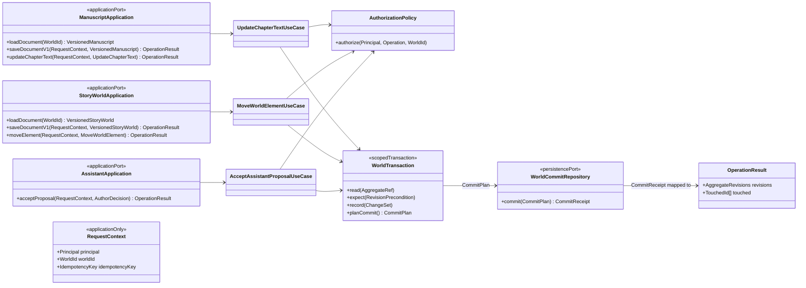
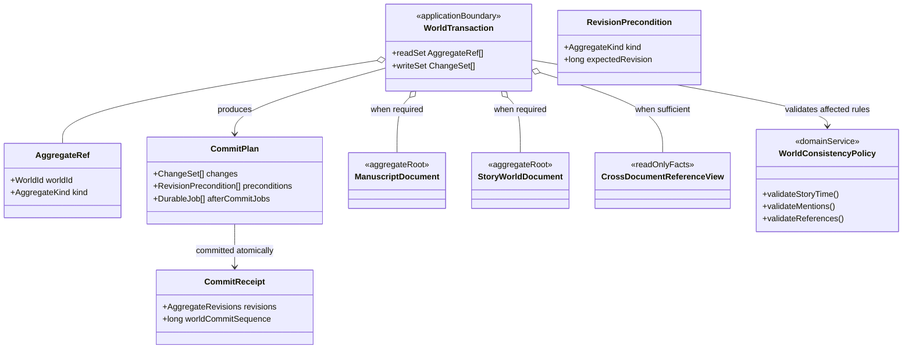
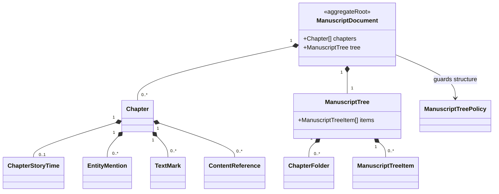
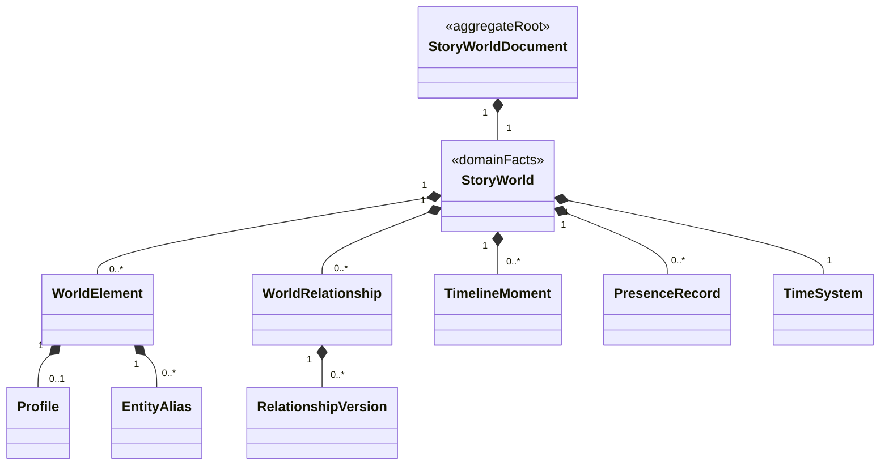
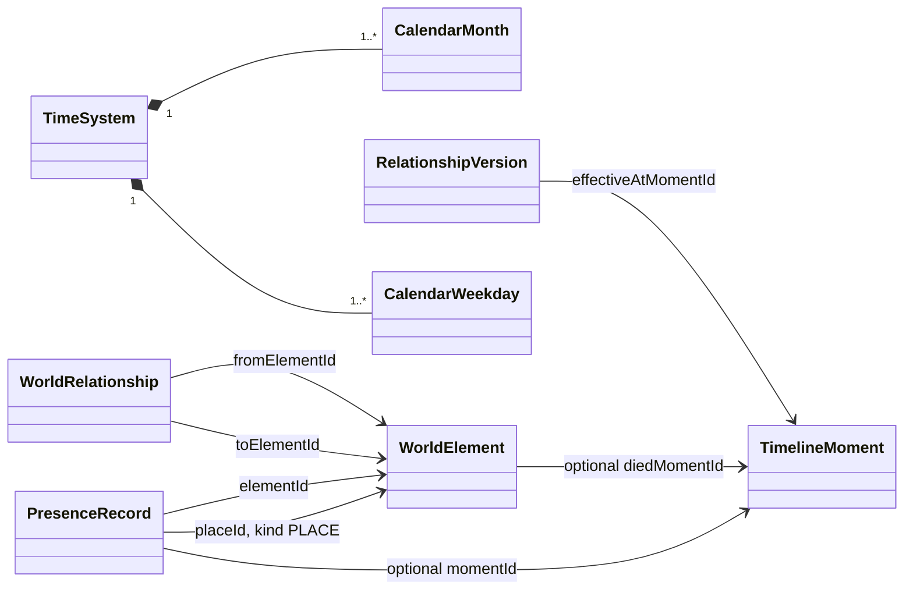
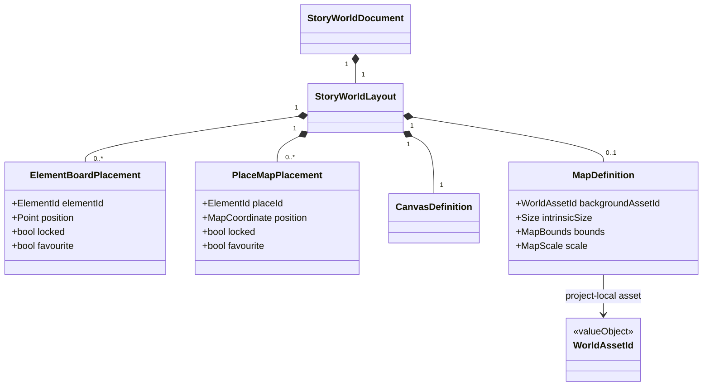
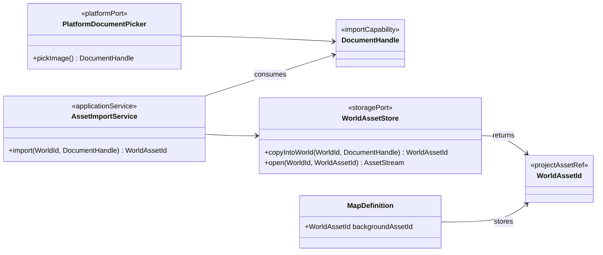
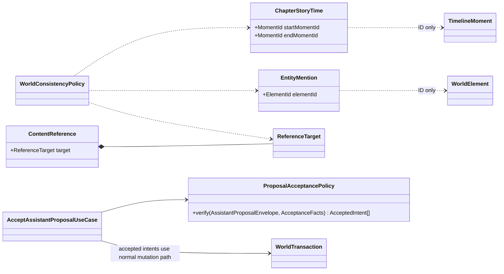

# Core software and domain model

Status: **proposed target view**

Answers: **Which boundaries own canonical state, and through which application
use cases may it change?**

This view records the intended ownership and dependency direction. Names shown
in the diagrams are reference names, not a requirement to create one class for
every box. Implementations may combine small collaborators while they preserve
the responsibilities and boundaries described here.

The design deliberately avoids a global command bus and a permanently hydrated
world snapshot. Quiltor is a local-first, single-author product: a use case
loads only the aggregate and reference data required for one operation. Existing
versioned full-document contracts remain supported during the migration.

## Application entry points and scoped mutations

Controllers depend on context-specific application ports. Authorization belongs
to the application layer; the domain receives an actor only if a concrete audit
or domain rule needs one. A generic <code>PrincipalId</code> never enters domain
commands.

<code>WorldTransaction</code> is an operation-scoped consistency boundary, not
an in-memory copy of the entire world. The use case declares its read and write
set:

- a chapter text update normally reads and writes only manuscript state;
- a board placement normally reads and writes only Story World layout;
- setting chapter story time additionally reads the referenced timeline facts;
- accepting a proposal reads every aggregate required by the accepted actions
  and commits all affected changes atomically.

Domain events may be used internally to derive changes or durable work, but they
are not part of the public <code>OperationResult</code>. UI callers receive
revisions, touched IDs and, where useful, a bounded updated read model. They do
not become coupled to internal event schemas or projection jobs.

## Commit and consistency boundary

The commit plan makes atomicity explicit. It contains changed aggregate state,
revision preconditions and durable after-commit work. The persistence adapter
must write the canonical changes, new revisions and durable jobs in one SQLite
transaction. Durable jobs are reserved for true side effects such as file
mirrors, remote backup transfer or thumbnails. Read models required immediately
for search or reference validation update transactionally with canonical state.

Manuscript and Story World revisions advance independently. An optional
monotonic world commit sequence can order change notifications without making
unrelated manuscript and layout changes conflict. A cross-document operation
expects and advances every aggregate revision it actually changes.

Cross-document rules therefore belong to <code>WorldConsistencyPolicy</code>,
but the policy receives only the facts required by the rule. It does not require
a global <code>WorldProjectSnapshot</code>.

Queries follow the same scoping rule. A context-specific query service reads a
chapter, Story World projection or reference view directly; no generic query
dispatcher or mutable repository is exposed to UI code.

## Manuscript ownership

Writing locale, project dictionary and symbol palette belong to
<code>ProjectSettings</code>, not manuscript content. Theme, panel layout and
selected inference provider are <code>UserPreferences</code>. Keeping these
separate prevents UI configuration from changing a manuscript revision.

The current full <code>ManuscriptDocument</code> remains a valid versioned wire
contract. Chapter-level loading may be introduced behind the application port
when measured manuscript size or mobile memory budgets require it; it is not a
prerequisite for the first migration step.

## Story World ownership

Story facts and author-owned visual layout may remain in one versioned wire
document while being distinct domain objects. An element does not own graph or
map coordinates; placement records reference it by stable ID.

The following ID-based associations carry Story World meaning without changing
the ownership graph:

Persisted author layout includes placements, locks, favourites and map
calibration. Viewport zoom, pan, hover and selection are ephemeral client state
and do not belong in <code>StoryWorldLayout</code>.

### Importing project-local assets

A platform document handle is a temporary import capability, never a domain
reference. <code>AssetImportService</code> copies the selected content into the
world's asset store and returns a stable <code>WorldAssetId</code>. Backup,
restore and export include those project-local assets.

Desktop paths, Apple security-scoped bookmarks and Android document URIs end at
the platform/import boundary. They are not serialized into
<code>MapDefinition</code>.

## Cross-document links and Assistant acceptance

Cross-document associations are stable IDs resolved by policies. They do not
create object ownership between aggregates.

The Assistant adapter may verify schema, evidence and resolution proofs. The
application acceptance use case performs authorization and stale-proof checks;
domain policies validate the resulting mutation. Accepted proposals therefore
use the same commit path as manual edits and never mutate a cloned document in
the UI.

## Current names to proposed responsibilities

| Current code                                               | Proposed owner or transition                              |
| ---------------------------------------------------------- | --------------------------------------------------------- |
| <code>Manuscript</code>                                    | <code>ManuscriptDocument</code>                           |
| <code>FigureState</code>                                   | <code>StoryWorldDocument</code> wire contract             |
| <code>FigureNode</code>                                    | <code>WorldElement</code> plus board/map placements       |
| <code>FigureEdge</code>                                    | <code>WorldRelationship</code>                            |
| <code>PresenceEntry</code>                                 | <code>PresenceRecord</code>                               |
| canvas/map coordinates and lock/favourite fields           | persisted <code>StoryWorldLayout</code> placement values  |
| viewport zoom, pan, hover and selection                    | ephemeral client view state                               |
| <code>tree.py</code> functions                             | <code>ManuscriptTreePolicy</code>                         |
| story-time validation plus counterpart loading             | scoped use case plus <code>WorldConsistencyPolicy</code>  |
| <code>resolve_before_create.py</code> decisions and proofs | proposal resolution and acceptance policies               |
| direct UI proposal mutation                                | <code>AcceptAssistantProposalUseCase</code>               |
| selected map file path or URI                              | <code>AssetImportService</code> to project-local asset ID |
| existing versioned full-document <code>save()</code>       | retained v1 use cases during incremental migration        |

## Intent and use-case families

The application contract should express product intent rather than a generic
JSON patch. These are families of focused use cases, not subclasses that must be
registered in one global dispatcher:

- manuscript: update chapter text, create or rename a chapter, move a tree item,
  set story time and maintain references;
- Story World facts: create or update elements and relationships, create moments,
  set presence and configure a time system;
- Story World layout: move or lock board/map placements, set favourites and
  configure the map asset and calibration;
- Assistant: accept an author-selected proposal and translate verified actions
  into the same mutation policies used by manual editing.

High-frequency typing remains coalesced by the client. During migration it may
flush through the existing versioned full-document endpoint; a focused chapter
operation can replace that wire path later without changing the ownership
model.
