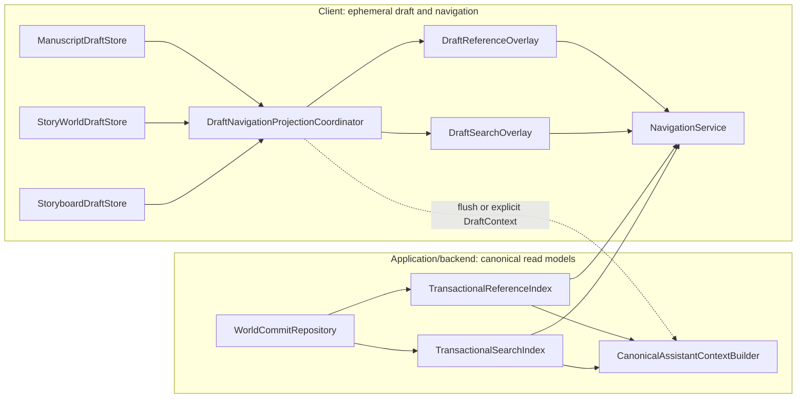
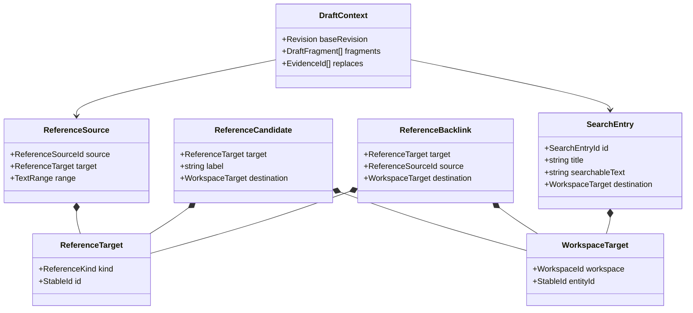
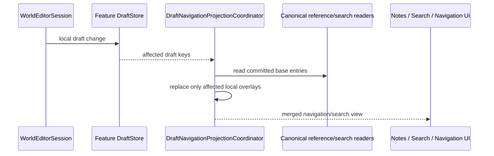
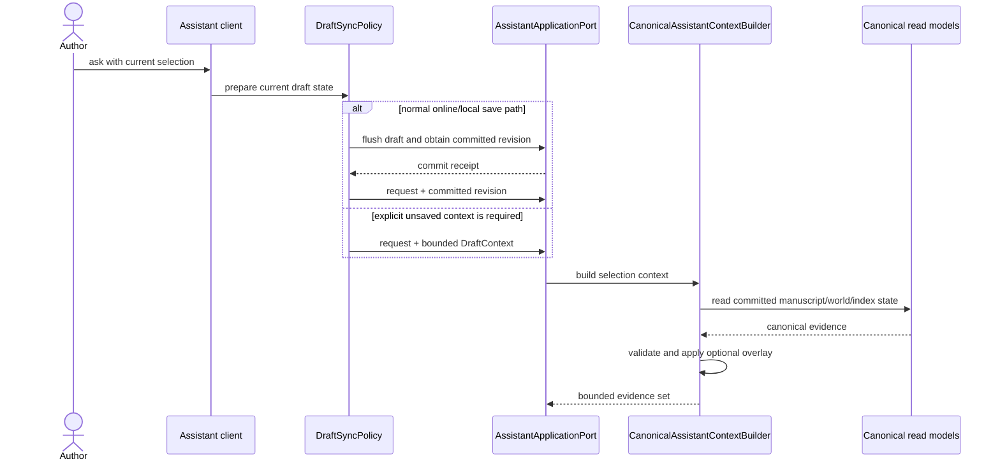
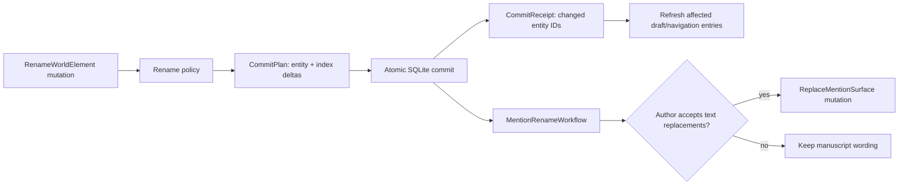

# Cross-feature projections and navigation

Status: **proposed target view**

Answers: **How do Manuscript, Story World and Storyboard feed navigation,
search, backlinks and Assistant context without duplicating canonical or
planning state?**

Client and application projections serve different consistency needs and must
not be conflated:

- client projections are ephemeral overlays for unsaved drafts, navigation and
  immediate UI feedback;
- canonical reference and FTS/search indexes are updated in the same SQLite
  transaction as the documents they describe;
- canonical Assistant context is built in the Assistant application/backend
  from committed read models plus an explicit bounded draft overlay.

No client projection is an aggregate or a second authority.

## Projection ownership

`DraftNavigationProjectionCoordinator` depends only on public draft/read-model
contracts. It may merge committed results with unsaved local overlays for the
visible author session. That merge is a UI convenience and is discarded or
rebuilt on reload.

`TransactionalReferenceIndex` and `TransactionalSearchIndex` are persistent
application read models. Their `IndexDelta`s are part of `CommitPlan`; therefore
a newly committed document and its immediately required search/backlink state
cannot disagree. They are not `projection_jobs`.

## Neutral projection values

`ReferenceTarget` kinds include chapter, world element/place, timeline moment
and Storyboard board. The kind is a contract discriminator, not a permission to
import the owning feature model. `DraftContext` is bounded, revision-stamped
and explicit; it cannot silently replace committed state.

The current client candidate index includes Storyboard boards, so global
search, `@` completion and Storyboard drag/drop share stable targets. The
derived backlink index now also reads Storyboard note references and direct
reference cards, retaining board and node IDs so navigation can select the
exact source card. Storyboard planning text is still not part of canonical
Assistant context until a later, explicitly labelled planning-context use case
is implemented.

## Draft navigation update sequence

Draft updates use affected keys and do not rebuild every entry after each
keystroke. Full rebuild remains available after load, migration and recovery.
The client does not build Assistant evidence in this sequence.

## Assistant context sequence

The default is to flush current drafts before inference. An explicit overlay is
reserved for cases where saving first would violate the interaction contract.
Its base revision and replacement scope are validated before it contributes to
evidence.

## Rename integration

A world-element rename derives reference/search `IndexDelta`s inside the same
commit as the canonical name. Stored manuscript surface text is author content
and is not silently rewritten. A `MentionRenameWorkflow` may offer reviewed
replacement mutations for affected occurrences.

Internal domain facts may help policies derive a `CommitPlan`, but raw domain
events are not exposed as a public client protocol.

## Current code to target responsibility

| Current code                                                                                    | Target class/responsibility                                     |
| ----------------------------------------------------------------------------------------------- | --------------------------------------------------------------- |
| `buildWorldReferenceCandidates` and `buildWorldReferenceBacklinks` over all three loaded drafts | client `DraftReferenceOverlay` plus canonical reference reader  |
| separate candidate building in Search                                                           | canonical index plus affected client `DraftSearchOverlay`       |
| `NoteReferenceProvider` with aggregate-derived values                                           | Notes consuming merged canonical/draft reference views          |
| `KnowledgeChunk` rebuilding in Assistant backend                                                | `CanonicalAssistantContextBuilder` over committed read models   |
| any client-built Assistant context                                                              | removed; flush or pass an explicit `DraftContext`               |
| nested rename detection in `Application.tsx`                                                    | rename policy, transactional index deltas and reviewed workflow |
| direct workspace-target conversion scattered by feature                                         | one client `NavigationService` over `WorkspaceTarget`           |

Canonical changes travel through the focused application path described in
[application/persistence](application-and-persistence.md). Assistant-specific
acceptance and evidence rules are described in
[assistant/inference](assistant-and-inference.md).
