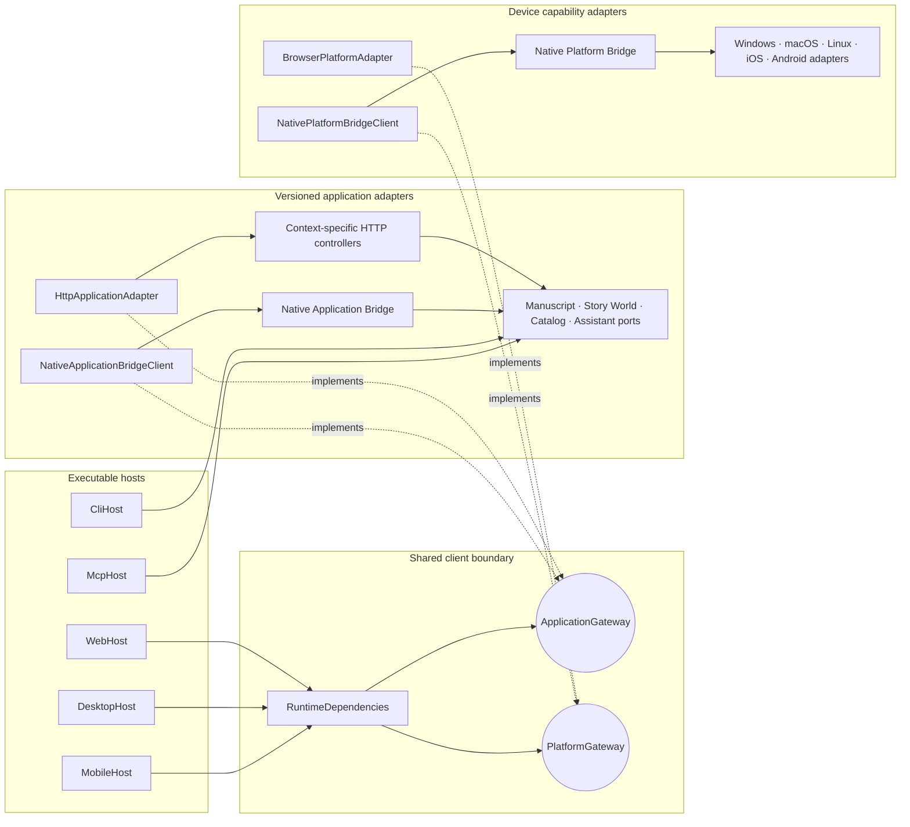
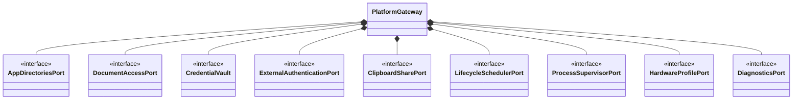
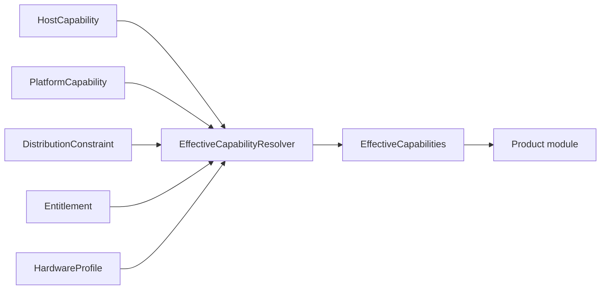
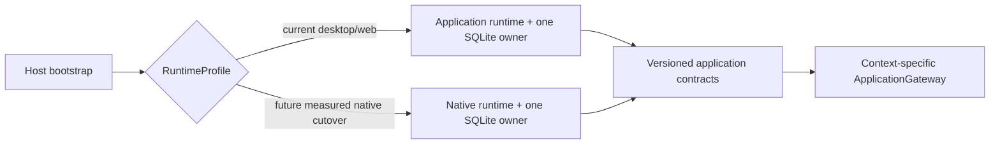
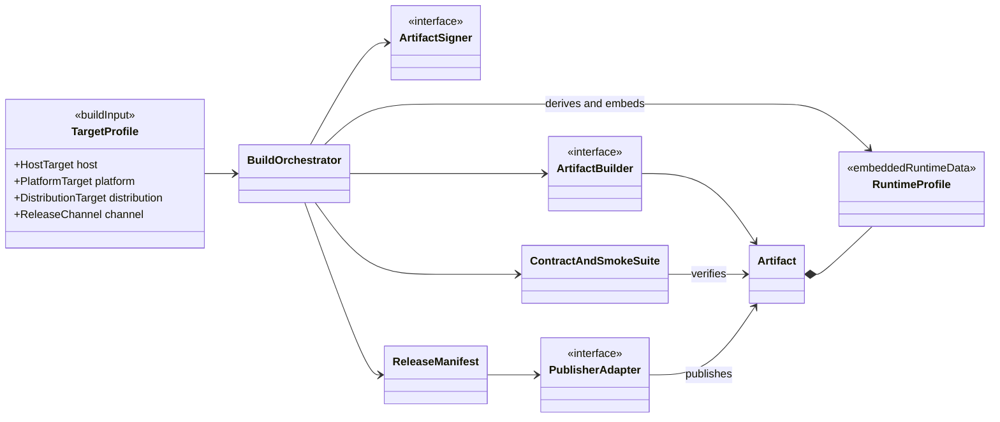
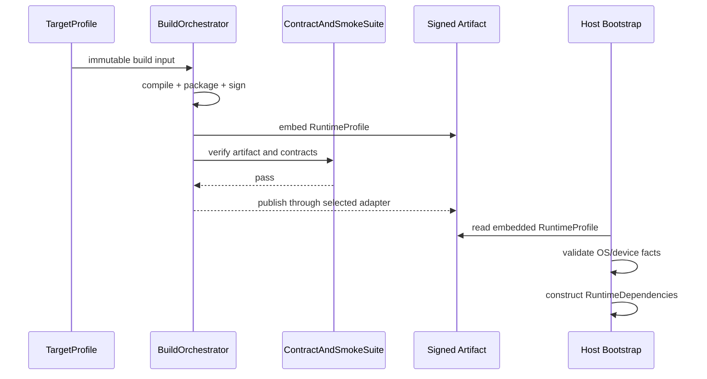

# Hosts, platform adapters and distribution

Status: **proposed target view**

Answers: **How do web, desktop, mobile and headless hosts compose the same
product, and how do installers/stores stay outside runtime product logic?**

Host, platform, distribution, release channel and entitlement are independent
axes. A Windows desktop host can be distributed directly or through Microsoft
Store without creating two product implementations. This view is a reference
composition; the binding principles and rollout gates are fixed in the
implementation plan.

## Runtime host composition

UI hosts inject one immutable `RuntimeDependencies` object into the shared
client. Its `ApplicationGateway` is a namespaced grouping of context-specific
ports, not a global facade or command bus. Headless hosts invoke the same focused
application ports without mounting React.

The two native bridges are intentionally unrelated:

- **Native Application Bridge** transports versioned, context-specific product
  operations;
- **Native Platform Bridge** exposes device capabilities such as documents,
  authentication, sharing and lifecycle.

No product request contains a Windows path, Apple bookmark or Android URI. A
temporary document handle may cross a platform-import workflow; canonical world
state stores only a project-owned `WorldAssetId`.

## Focused platform ports

Hosts provide only supported capabilities:

| Platform adapter | Typical implementations                                                                                                                                                 |
| ---------------- | ----------------------------------------------------------------------------------------------------------------------------------------------------------------------- |
| Browser          | origin storage/preferences, browser clipboard/navigation, File System Access or download fallback; no process supervisor                                                |
| Windows          | known folders, Win32 document picker, Credential Manager, protocol activation, sharing, process supervision, GPU/RAM probe                                              |
| macOS            | Application Support/cache locations, security-scoped bookmarks, Keychain, ASWebAuthenticationSession, share services, process/hardware probe where distribution permits |
| Linux            | XDG directories, portal document handles, Secret Service, URI activation, process supervision and hardware probe                                                        |
| iOS              | app-group/container directories, security-scoped document handles, Keychain, AuthenticationServices, share sheet and lifecycle scheduling; no arbitrary child process   |
| Android          | app storage, persisted Storage Access Framework URI, Keystore, Custom Tabs, Sharesheet and WorkManager/lifecycle; no desktop process model                              |

Desktop window, tray and menu classes stay inside their desktop host and are not
added to `PlatformGateway` unless product code genuinely consumes the
capability.

## Runtime capability calculation

Product modules receive the result, not the axes. Inference execution may use
the hardware portion through its dedicated port, but provider registries and a
model control plane are introduced only when product triggers require them.

## Runtime and storage ownership

Each artifact embeds one coherent application/storage implementation profile.
A host may select an HTTP adapter or Native Application Bridge, but it never
chooses Python for one write and Rust for another.

Pure deterministic policies may migrate behind focused Rust ports earlier,
provided shared contract fixtures exist. SQLite persistence does not migrate
operation by operation. A full native storage cutover is gated by a concrete
mobile/native milestone, simulator tests and performance measurements; until
then the existing storage owner remains authoritative.

## Build and publishing model

Build-time classes do not appear in the runtime host diagram. `TargetProfile` is
the typed source input; `RuntimeProfile` is the immutable subset embedded in an
artifact.

### Artifact builders

| Builder adapter                 | Output                                                          |
| ------------------------------- | --------------------------------------------------------------- |
| `WebArtifactBuilder`            | static client plus server/container assets                      |
| `WindowsInstallerBuilder`       | signed MSIX/MSI/installer for direct Windows distribution       |
| `MacInstallerBuilder`           | signed/notarised app plus DMG/PKG for direct macOS distribution |
| `LinuxPackageBuilder`           | AppImage/deb/rpm/portable archive as selected by profile        |
| `AppleStoreArtifactBuilder`     | App Store/TestFlight-compliant macOS or iOS archive             |
| `GooglePlayArtifactBuilder`     | Android App Bundle for Play tracks                              |
| `MicrosoftStoreArtifactBuilder` | Store-compliant MSIX package                                    |
| `PythonPackageBuilder`          | wheel/sdist for PyPI when the profile allows it                 |
| `ContainerArtifactBuilder`      | OCI image                                                       |

### Publisher adapters

`AppleAppStorePublisher`, `GooglePlayPublisher`,
`MicrosoftStorePublisher`, `DirectDownloadPublisher`, `GitHubPublisher`,
`PyPIPublisher` and `OciPublisher` implement `PublisherAdapter`. Publisher SDKs,
credentials, signing and store metadata remain under `distribution/` and CI;
they are never linked into product modules.

## Build-to-runtime handoff

Runtime OS detection may validate a profile and probe capabilities. It may not
guess whether the artifact came from Apple, Google, Microsoft or a direct
download.

## Current code to target responsibility

| Current code/concept                                       | Target responsibility                                                     |
| ---------------------------------------------------------- | ------------------------------------------------------------------------- |
| `apps/web/main.tsx`                                        | `WebHost` composition root                                                |
| packaged HTTP/desktop/CLI/MCP entrypoints                  | explicit host composition roots                                           |
| `QuiltorClient` object plus mutable configuration function | injected immutable `RuntimeDependencies`                                  |
| current namespaced application gateways                    | retained context-specific `ApplicationGateway` shape                      |
| current application HTTP gateways                          | `HttpApplicationAdapter`                                                  |
| Native Bridge v1 `file.save`                               | Native Platform Bridge file import; canonical storage uses `WorldAssetId` |
| generic application routing                                | versioned controllers/bridge calls mapped directly to focused use cases   |
| build profile JSON                                         | typed source `TargetProfile`                                              |
| runtime profile facts                                      | embedded immutable `RuntimeProfile`, including one persistence owner      |
| platform/store names in conditionals                       | platform, artifact-builder or publisher adapters                          |

Adding a target is additive: profile, missing adapters, builder/signing,
publisher metadata and target tests. It does not branch Manuscript, Story World,
Timeline or Assistant product logic.
